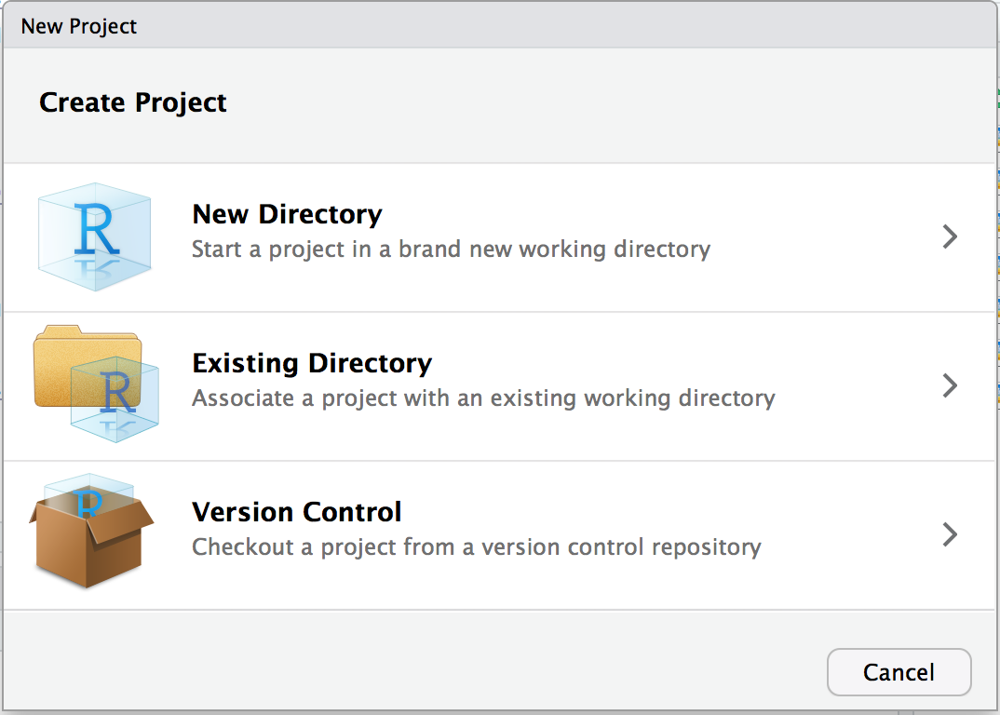

# Navigating the Software {#NavigatingTheSoftware}

## Introduction {-}


Both R and RStudio are big chunks of software, first and foremost. You will inevitably spend time doing what one does with any big piece of software: configuring it, customizing it, updating it, and fitting it into your computing environment. This chapter will help you perform those tasks. There is nothing here about numerics, statistics, or graphics. This is all about dealing with R and RStudio as software.

## Download and load libraries {-}

```{r, message=FALSE, warning=FALSE}
if (!require("pacman")) install.packages("pacman")
pacman::p_load(tidyverse) # All purpose wrangling for dataframes

```


```{r workspace, fig.cap= "Your workspace -- all the objects, functions, and delicious glue you've defined in your current session.", fig.margin = TRUE, echo = FALSE, out.width = "75%", fig.align='center'}
knitr::include_graphics(c("images/chapter-3/workspace.jpg"))
```


Remember way back in Chapter 3 when I said everything in R is an object? Well, that's still true. In this chapter, we'll cover the basics of R object management. We'll cover how to load new objects like external datasets into R, how to manage the objects that you already have, and how to export objects from R into external files that you can share with other people or store for your own future use.


## Getting and Setting the Working Directory {#NAVIGATE-WORKING-DIRECTORY}

Your computer is a maze of folders, files. Outside of R, when you want to open a specific file, you probably open up an explorer window that allows you to visually search through the folders on your computer. Or, maybe you select recent files, or type the name of the file in a search box to let your computer do the searching for you. While this system usually works for non-programming tasks, it is a no-go for R. Why? Well, the main problem is that all of these methods require you to *visually* scan your folders and move your mouse to select folders and files that match what you are looking for. When you are programming in R, you need to specify *all* steps in your analyses in a way that can be easily replicated by others and your future self. This means you can't just say: "Find this one file I emailed to myself a week ago" or "Look for a file that looks something like `experimentAversion3.txt`." Instead, you need to be able to write R code that tells R *exactly* where to find critical files -- either on your computer or on the web.

To make this job easier, R uses **working directories**. A working directory is where everything starts and ends. Your working directory is important because it is the default location for all file input and output—including reading and writing data files, opening and saving script files, and saving your workspace image. Many of you who previously worked with SPSS using the point-click interface, would often wonder 1) where did my saved SPSS file went? or 2) where did my exported image go to? This confusion arise because often you do not know what was the default working directory. Rather than relying on the default, we specify it explicitly so we know where to store our files, and where this software goes looking for files.


The easiest and recommended way to set your working directory is using RStudio projects. For every piece of work/assessment, you create a project. The project is a folder that can live anywhere on your computer - your desktop, downloads folder, documents folder, etc. In this folder, it contains everything from your files to be analyzed, codes, and exported files and images. Everything is self-contained, there is no confusion.

## Creating a new Rstudio project{#NAVIGATE-PROJECTS}

You want to create a new RStudio project to keep all your files related to a specific project. 
Click File → New Project as in Figure \@ref(fig:filenew-drop). ** I ALWAYS use this approach, please use it too**

```{r filenew-drop, echo=FALSE, eval=TRUE, fig.cap="Selecting New Project"}
knitr::include_graphics("images/chapter-3/rstudio.file.newproject.png")
```

This will open the New Project dialog box and allow you to choose which type of project you would like to create, as shown in Figure \@ref(fig:filenewmenu).

```{r filenewmenu, echo=FALSE, eval=TRUE, fig.cap="New Project dialog"}

```

Projects are a powerful concept that's specific to RStudio. They help you by doing the following:

-  Setting your working directory to the project directory.
-  Preserving window state in RStudio so when you return to a project your windows are all as you left them. This includes opening any files you had open when you last saved your project. 
-  Preserving RStudio project settings.

To hold your project settings, RStudio creates a project file with an *.Rproj* extension in the project directory. If you open the project file in RStudio, it works like a shortcut for opening the project. In addition, RStudio creates a hidden directory named *.Rproj.user* to house temporary files related to your project. 

Any time you're working on something nontrivial in R we recommend creating an RStudio project. Projects help you stay organized and make your project workflow easier. 


## Installing Packages {#NAVIGATE-INSTALL-PACKAGE}

When you download and install R for the first time, you are installing the Base R software. Base R will contain most of the functions you'll use on a daily basis like `mean()` and `hist()`. However, only functions written by the original authors of the R language will appear here. If you want to access data and code written by other people, you'll need to install it as a *package*. An R package is simply a bunch of data, from functions, to help menus, to vignettes (examples), stored in one neat package.


```{r package, fig.cap= "An R package is like a lightbulb. First you need to order it with install.packages(). Then, every time you want to use it, you need to turn it on with library()", fig.margin = TRUE, fig.align = 'center', echo = FALSE, out.width = "50%"}
knitr::include_graphics(c("images/chapter-3/packagebulb.png"))
```


A package is like a light bulb. In order to use it, you first need to order it to your house (i.e.; your computer) by *installing* it. Once you've installed a package, you never need to install it again. However, every time you want to actually use the package, you need to turn it on  by *loading* it. Here's how to do it.


### Installing a new package

Installing a package simply means downloading the package code onto your personal computer. There are two main ways to install new packages. The first, and most common, method is to download them from the Comprehensive R Archive Network (CRAN). CRAN is the central repository for R packages. To install a new R package from CRAN, you can simply run the code `install.packages("name")`, where "name" is the name of the package. For example, to download the `tidyverse` package, which contains several functions we will use in this book, you should run the following:


```{r cran, fig.cap= "CRAN (Comprehensive R Archive Network) is the main source of R packages", fig.margin = TRUE, fig.align = 'center', echo = FALSE, out.width = "50%"}
knitr::include_graphics(c("images/chapter-3/cran.png"))
```


```{r eval = FALSE}
# Install the tidyverse package from CRAN
#   You only need to install a package once!
install.packages("tidyverse")
```


When you run `install.packages("name")` R will download the package from CRAN. If everything works, you should see some information about where the package is being downloaded from, in addition to a progress bar.

```{r installingpackages, fig.cap= "When you install a new package, you'll see some random text like this you the download progress. You don't need to memorize this.", fig.margin = TRUE, fig.align = 'center', echo = FALSE, out.width = "75%"}
knitr::include_graphics(c("images/chapter-3/installingpackages.png"))
```


Like ordering a light bulb, once you've installed a package on your computer you never need to install it again (unless you want to try to install a new version of the package). However, every time you want to use it, you need to turn it on by loading it.


### Loading a package

Once you've installed a package, it's on your computer. However, just because it's on your computer doesn't mean R is ready to use it. If you want to use something, like a function or dataset, from a package you *always* need to *load* the package in your R session first. Just like a light bulb, you need to turn it on to use it!

To load a package, you use the `library()` function. For example, now that we've installed the `tidyverse` package, we can load it with `library("tidyverse")`:

```{r, message = FALSE}
# Load the tidyverse package so I can use it!
#   You have to load a package in every new R session!
library("tidyverse")
```


Now that you've loaded the `tidyverse` package, you can use any of its functions! Let us create a very simple histogram plot using a default dataset found within R.  Don't worry about the specifics of the code below, you'll learn more about how all this works later. For now, just run the code and marvel at your plot in TWO LINES.

```{r}
# Make a pirateplot using the pirateplot() function
#  from the yarrr package!

ggplot(mtcars,aes(x=mpg)) + 
  geom_histogram(binwidth=5)
```

### A simple approach to package

For novices, the  `pacman` package can be used. All you need to do is to type in the name of the package in the function `pacman::p_load()`. In the example below, I want `pacman` to load the package `tidverse` -- notice how `""` are not used. If `tidverse` is not found in your computer, `pacman` will download it first, than automatically load it. I will use this command from now on when loading packages.

```{r , message=FALSE, warning=FALSE}

if (!require("pacman")) install.packages("pacman")
pacman::p_load(tidyverse) # All purpose wrangling for dataframes

```

## Learning check {#NAVIGATE-LEARNING-CHECK}


1. Create a folder called `se201` on your computer desktop.

2. Create a new project **inside** the folder `se201`, click File -- New Project -- New Directory -- New Project -- Browse, search for `se201` folder -- under Directory name, type `practice`.

3. Create a new R script, click File -- New File -- R Script.

4. Save the new R script, click File -- Save As. Use the file name `practice_script`. It will have the extension `.R` assigned to it automatically

5. Enter the code below into your new script, and save it. 

```{r, eval = FALSE}

# This is my first lines of codes
a <- 10
a + 10
a

```

6. Enter the code below to install and load the packages.

```{r, eval = FALSE}

if (!require("pacman")) install.packages("pacman")
pacman::p_load(tidyverse, # All purpose wrangling for dataframes
               openxlsx,# writing excel documents
               lubridate,# date-time 
               tibbletime) # moving average for vo2

```

7. Close RStudio, reopen RStudio via the `.Rproj` symbol. In the Files tab on the bottom right, you should see the script you created `practice_script.R`. Click on it to open and you should see the code you typed. Try to run the codes you typed, what answer did you get?


