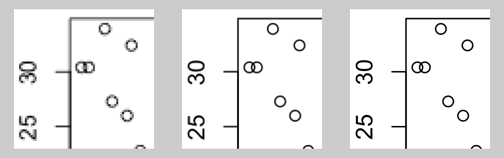

--- 
title: "A Simple Cookbook for Wrangling and Visualization"
author: "Bernard Liew"
date: "`r Sys.Date()`"
output: bookdown::gitbook
documentclass: book
link-citations: yes
mainfont: Arial
monofont: Courier New
monofontoptions: Scale=0.7
bibliography: [book.bib]
site: bookdown::bookdown_site
biblio-style: apalike
---

# Preface {#intro}

The purpose of this book is to help you CLEAN your data and produce AMAZING graphics **EASILY** but not fast at first.


**What this book is**

This books is intended to be a cookbook based approach. It has problems and it has solutions. Recipes are provided from which you can edit the necessary portions for your needs. 

**What this book is not**

This book does not cover any one topic in extensive detail. If you are interested in conducting analyses or creating plots not covered in the book, I'm sure you'll find the answer with a quick Google search!

## Why is R so great?

1. R is 100\% free and as a result, has a huge support community. Unlike SPSS and even Excel, R is, and always will be completely free. This doesn't just help your wallet - it means that a huge community of R programmers who will constantly develop and distribute new R functionality and packages at a speed that leaves all those other packages in the dust! If you ever have a question about how to implement something in R, a quick Google search will lead you to your answer virtually every single time.

2. R is incredibly versatile. You can use R to do everything from calculating simple summary statistics, to performing complex simulations to creating gorgeous plots. If you can imagine an analytical task, you can almost certainly implement it in R.

3. Analyses conducted in R are transparent, easily shareable, and reproducible. If you ask an SPSS user how they conducted a specific analyses, they will either A) Not remember, B) Try (nervously) to construct an analysis procedure on the spot that makes sense - which may or may not correspond to what they actually did months or years ago, or C) Ask you what you are doing in their house. I used to primarily use SPSS, so I speak from experience on this. If you ask an R user (who uses good programming techniques!) how they conducted an analysis, they should always be able to show you the exact code they used. Of course, this doesn't mean that they used the appropriate analysis or interpreted it correctly, but with all the original code, any problems should be completely transparent!


## Why R is like a relationship... {#rrelationship}

Yes, R is very much like a relationship. Like relationships, there are two major truths to R programming:

```{r relationship, echo=FALSE, fig.height=15, fig.width=10, fig.cap = "R will become both your best friend and your worst nightmare. The bad times will make the good times oh so much sweeter.", fig.align='center'}
knitr::include_graphics("images/index/rrelationship.png")
```

1. There is nothing more *frustrating* than when your code does *not* work

2. There is nothing more *satisfying* than when your code *does* work!


Anything worth doing, from losing weight to getting a degree, takes time. Learning R is no different. Especially if this is your first experience programming, you are going to experience a *lot* of headaches when you get started. You will run into error after error and pound your fists against the table screaming: "WHY ISN'T MY CODE WORKING?!?!? There must be something wrong with this stupid software!!!" You will spend hours trying to find a bug in your code, only to find that - frustratingly enough, you had had an extra space or missed a comma somewhere. You'll then wonder why you ever decided to learn R when (::sigh::) SPSS was so "nice and easy."


```{r gosling, echo = FALSE, fig.height=15, fig.width=10, fig.cap = "When you first meet R, it will look so fugly that you'll wonder if this is all some kind of sick joke. But trust me, once you learn how to talk to it, and clean it up a bit, all your friends will be crazy jealous.", fig.align='center'}
knitr::include_graphics("images/index/gosling.png")
```


Trust me, as you gain more programming experience, you'll experience fewer and fewer bugs (though they'll never go away completely). Once you get over the initial barriers, you'll find yourself conducting analyses much, much faster than you ever did before.

## 3 things students get wrong

Based on teaching the previous cohort, there are 3 common errors students make, which will result in errors, leaving many scratching their head, feeling frustrated. Be aware of these errors, and do not fall into the trap.

### Wrong method of launching software

This is the biggest source of frustration.Once you have created a project folder for your work, ONLY launch the software by clicking on the blue cube symbol as seen in Figure \@ref(fig:launching). In chapter \@ref(NavigatingTheSoftware), I will explain why you should launch the software in this manner.  

```{r launching, echo=FALSE, fig.height=8, fig.width=5, fig.cap = "This is the symbol to press to launch the software in your asssignment.", fig.align='left'}
knitr::include_graphics("images/index/rstudio_projects.png")
```

### Not running code from START

Looking at the figure \@ref(fig:codeStart) below, say you ran the code from line 3 to line 20, when you close the software - maybe leaving the work partially done for the day, the next time you launch the software, it has no recollection of where you stopped. You need to run the software from the first line of the code to where you stopped, and then continue with your work.

```{r codeStart, echo=FALSE, fig.height=15, fig.width=12, fig.cap = "If you restart your analysis, the software does not have a memory of where you stopped previously .", fig.align='center'}
knitr::include_graphics("images/index/runCodeStart.png")
```


### Typographical errors

More than 50\%  of the student queries in the past, centered around the issue of typographical errors. Given that humans can (and do) communicate without perfect grammar, punctuation, and spelling, you WILL naturally assume (wrongly) that computers can ignore mistakes as we can. Computers cannot distinguish what is or is not supposed to be there. For example, if you create a table and call it `mytable`, but then tried to do some calculations on `my table`, and error will appear, such as `Error: unexpected symbol in "my table"`. This error means the computer cannot find `my table`, only because it does not EXIST. 


## R resources

### R books

There are many, many excellent (non-pirate) books on R, some of which are available online for free. Here are some that I highly recommend:

| Book| Description|
|:----------------------------|:-----------------------------------|
|     [R for Data Science by Garrett Grolemund and Hadley Wickham](http://r4ds.had.co.nz/)| The best book to learn the latest tools for elegantly doing data science.|
|     [R Graphics Cookbook by Winston Chang](http://www.cookbook-r.com/Graphs/)| Is indispensible for creating graphics.|
|     [R Cookbook by James (JD) Long and Paul Teetor](https://rc2e.com/index.html)|Is a useful bag of tips and tricks to get started with R .|


<!--chapter:end:index.Rmd-->


# Getting Started {#get-started}

## Installing Base-R and RStudio {#INSTALL-GET-STARTED}

To use R, we'll need to download **2** software: **Base-R**, and **RStudio**. Base-R is the basic software which contains the R programming language. RStudio is a software that makes programming easier. In everyday parlance, R is the engine and RStudio is the car's frame. Just like you can transfer an engine to different car frames, you can use R using other platforms. But I will use RStudio. Of course, they are totally free and open source.

### Check for version updates

R and RStudio have been around for several years -- however, they are *constantly* being updated with new features and bug-fixes. At the time that I am writing this sentence ("`r Sys.Date()`"), the latest version of Base-R is 4.1.1, and the latest version of RStudio is 1.4.1717.

```{r rlogo, fig.cap= "R logo", fig.margin = TRUE, echo = FALSE, out.width = "40%", fig.align="center"}
knitr::include_graphics(c("images/chapter-1/Rlogo.png"))
```

To install Base-R, click on one of the following links and follow the instructions.

| Operating System| Link|
|:------|:----|
|     Windows|    [http://cran.r-project.org/bin/windows/base/](http://cran.r-project.org/bin/windows/base/)|
|     Mac|    [http://cran.r-project.org/bin/macosx/](http://cran.r-project.org/bin/macosx/)|


Once you've installed base-R on your computer, try opening it. When you do you should see a screen like the one in Figure \@ref(fig:rscreenshot) (this is the Windows version). As you can see, base R is very much bare-bones software. It's kind of the equivalent of a simple text editor that comes with your computer.

```{r rscreenshot, fig.cap= "Here is how the base R application looks. While you can use the base R application alone, most people I know use RStudio -- software that helps you to write and use R code more efficiently!", fig.margin = TRUE, echo = FALSE, out.width = "75%", fig.align ="center"}
knitr::include_graphics(c("images/chapter-1/RScreenshot.png"))
```


```{r rstudiologo, fig.cap= "RStudio logo", fig.margin = TRUE, echo = FALSE, out.width = "40%", fig.align="center"}
knitr::include_graphics(c("images/chapter-1/RStudio.png"))
```

While you can do pretty much everything you want within base-R, you'll find that most people these days do their R programming in an application called RStudio. RStudio is a graphical user interface (GUI)-like interface for R that makes programming in R a bit easier. In fact, once you've installed RStudio, you'll likely never need to open the base R application again. 

To download and install RStudio (around 40mb), click on the link below: [https://rstudio.com/products/rstudio/download/#download/](https://rstudio.com/products/rstudio/download/#download)


## The four RStudio Windows {#INSTALL-GET-FAMILIAR}

Let's go ahead and boot up RStudio and see how she looks! When you open RStudio, you'll see the following four windows (also called panes) shown in in Figure \@ref(fig:rstudiowindows). However, your windows might be in a different order that those in Figure \@ref(fig:rstudiowindows). Ignore for a fact that my screen shows black and yours shows up as white. This is like the wall paper on your computer, it is what makes my eyes at ease.


```{r rstudiowindows, fig.cap= "The four panes of RStudio.", fig.margin = TRUE, echo = FALSE, out.width = "100%", fig.align="center"}
knitr::include_graphics(c("images/chapter-1/RStudio_Screenshot_Labels.png"))
```

Now, let's see what each window does in detail.

### Source - Your notepad for code

```{r sourcewindow, fig.cap= "The Source contains all of your individual R scripts. The code won't be evaluated until you send it to the Console.", fig.margin = TRUE, echo = FALSE, out.width = "100%", fig.align='center'}
knitr::include_graphics(c("images/chapter-1/piratesanalysisss.png"))
```

The source pane is where you create and edit "R Scripts" - your collections of code. Don't worry, R scripts are just text files with the ".R" extension. When you open RStudio, it will automatically start a new Untitled script. Before you start typing in an untitled R script, you should always save the file under a new file name (like, "StatsAnal.R"). That way, if something on your computer crashes while you're working, R will have your code waiting for you when you re-open RStudio.

You'll notice that when you're typing code in a script in the Source panel, R won't actually evaluate the code as you type. To have R actually evaluate your code, you need to first 'send' the code to the Console (we'll talk about this in the next section).

There are many ways to send your code from the Source to the console. The slowest way is to copy and paste. A faster way is to highlight the code you wish to evaluate and clicking on the "Run" button on the top right of the Source. Alternatively, you can use the hot-key "Command + Return" on Mac, or "Control + Enter" on PC to send all highlighted code to the console.


### Console: R's Heart

```{r consolewindow, fig.cap= "The console the calculation heart of R. All of your code will (eventually) go through here.", fig.margin = TRUE, echo = FALSE, out.width = "75%"}
knitr::include_graphics(c("images/chapter-1/consoless.png"))
```


The console is the heart of R. Here is where R actually evaluates code. At the beginning of the console you'll see the character \texttt{>}. This is a prompt that tells you that R is ready for new code. You can type code directly into the console after the \texttt{>} prompt and get an immediate response. For example, if you type 1+1 into the console and press enter, you'll see that R immediately gives an output of 2.

```{r}
1+1
```


Try calculating 1+1 by typing the code directly into the console - then press Enter. You should see the result [1] 2. Don't worry about the [1] for now, we'll get to that later. For now, we're happy if we just see the 2. Then, type the same code into the Source, and then send the code to the Console by highlighting the code and clicking the "Run" button on the top right hand corner of the Source window. Alternatively, you can use the hot-key "Command + Return" on Mac or "Control + Enter" on Windows.

**Tip**: Try to write most of your code in a document in the Source. Only type directly into the Console to do quick calculations like you are using a calculator.

So as you can see, you can execute code either by running it from the Source or by typing it directly into the Console. However, 99\% most of the time, you should be using the Source rather than the Console. The reason for this is straightforward: If you type code into the console, it won't be saved (though you can look back on your command History). And if you make a mistake in typing code into the console, you'd have to re-type everything all over again. Instead, it's better to write all your code in the Source. When you are ready to execute some code, you can then send "Run" it to the console.


### Environment / History


```{r environwindow, fig.cap= "The environment panel shows you all the objects you have defined in your current workspace.", fig.margin = TRUE, echo = FALSE, out.width = "75%"}
knitr::include_graphics(c("images/chapter-1/environmentss.png"))
```

The Environment tab of this panel shows you the names of all the data objects (like vectors, matrices, and dataframes) that you've defined in your current R session. You can also see information like the number of observations and rows in data objects. The tab also has a few clickable actions like "Import Dataset" which will open a graphical user interface (GUI) for importing data into R. 

The History tab of this panel simply shows you a history of all the code you've previously evaluated in the Console. 

As you get more comfortable with R, you might find the Environment / History panel useful. But for now you can just ignore it. If you want to declutter your screen, you can even just minimize the window by clicking the minimize button on the top right of the panel.


### Files / Plots / Packages / Help

The Files / Plots / Packages / Help panel shows you lots of helpful information. Let's go through each tab in detail:

1. Files - The files panel gives you access to the file directory on your hard drive. One nice feature of the "Files" panel is that you can use it to set your working directory. We'll talk about working directories in more detail soon.

2. Plots - The Plots panel (no big surprise), shows all your plots. There are buttons for opening the plot in a separate window and exporting the plot as a pdf or jpeg (though you can also do this with code using the `pdf()` or `jpeg()` functions.)

Let's see how plots are displayed in the Plots panel. Run the code on the right to display a histogram of the weights of chickens stored in the `ChickWeight` dataset. When you do, you should see a plot similar to the one in Figure \@ref(fig:plotpanel) show up in the Plots panel.

```{r, eval = FALSE}
hist(x = ChickWeight$weight,
     main = "Chicken Weights",
     xlab = "Weight",
     col = "skyblue",
     border = "white")
```


```{r plotpanel, fig.cap= "The plot panel contains all of your plots, like this histogram of the distribution of chicken weights.", fig.margin = TRUE, echo = FALSE, out.width = "75%"}
knitr::include_graphics(c("images/chapter-1/plotpanelss.png"))
```


3. Packages - Shows a list of all the R packages installed on your harddrive and indicates whether or not they are currently loaded. Packages that are loaded in the current session are checked while those that are installed but not yet loaded are unchecked. We'll discuss packages in more detail in the next section.

4. Help - Help menu for R functions. You can either type the name of a function in the search window, or use the code \texttt{?function.name} to search for a function with the name \texttt{function.name}


```{r, eval = FALSE}
?hist   # How does the histogram function work?
?t.test # What about a t-test?
```


## Reading and writing Code {#INSTALL-READ-WRITE-CODE}

### Code Chunks

In this book, R code is (almost) always presented in a separate gray box like this one:

```{r, eval = TRUE}
# A code chunk

# Define a vector a as the integers from 1 to 5
a <- 1:5

# Print a
a

# What is the mean of a?
mean(a)
```

This is called a *code chunk*. You should always be able to copy and paste code chunks directly into R. If you copy a chunk and it does not work for you, it is most likely because the code refers to a package, function, or object that I defined in a previous chunk. If so, read back and look for a previous chunk that contains the missing definition.

### Comments with \#

Lines that begin with \# are comments. If you evaluate any code that starts with \#, R will just ignore that line. In this book, comments will be either be literal comments that I write directly to explain code, or they will be *output* generated automatically from R. For example, in the code chunk below, you see lines starting with \#\#. These are the output from the previous line(s) of code. When you run the code yourself, you should see the same output in your *console*.

```{r}
# This is a comment I wrote

1 + 2

# The line above (## [1] 3) is the output from the previous code that has been 'commented out'
```


### Element numbers in output [1] 

The output you see will often start with one or more number(s) in brackets such as [1]. This is just a visual way of telling you where the numbers occur in the output. For example, in the code below, I will print a long vector containing the multiples of 2 from 0 to 100:

```{r}
seq(from = 0, to = 100, by = 2)
```

As you can see, the first line of the output starts with \#\# [1], and the next two lines start with [18] and [35]. This is just telling you that 0 is the [1]st element, 34 is the [18]th element, and 68 is the [35]th element. Sometimes this information will be helpful, but most of the time you can just ignore it.

## Debugging {#INSTALL-DEBUG}

When you are programming, you will always, and I do mean always, make errors (also called bugs) in your code. You might misspell a function, include an extra comma, or some days...R just won't want to work with you  (again, see section [Why R is like a Relationship](#rrelationship)).

Debugging will always be a challenge. However, over time you'll learn which bugs are the most common and get faster and faster at finding and correcting them. 

Here are the most common bugs you'll run into as you start your R journey.


### R is not ready (>)

Another very common problem occurs when R does not seem to be responding to your code. That is, you might run some code like `mean(x)` expecting some output, but instead, nothing happens. This can be very frustrating because, rather than getting an error, just nothing happens at all. The most common reason for this is because R isn't *ready* for new code, instead, it is *waiting* for you to finish code you started earlier, but never properly finished. 

Think about it this way, R can be in one of two states: it is either **Ready** (>) for new code, or it is **Waiting** (+) for you to finish old code. To see which state R is in, all you have to do is look at the symbol on the console. The `>` symbol means that R is Ready for new code -- this is usually what you want to see. The `+` symbol means that R is Waiting for you to (properly) finish code you started before. If you see the `+` symbol, then no matter how much new code you write, R won't actually evaluate it until you finish the code you started before.

Thankfully there is an easy solution to this problem (See Figure \@ref(fig:rstate)): Just hit the escape key on your keyboard. This will cancel R's waiting state and make it Ready!


```{r rstate, echo = FALSE, out.width = "50%", fig.align='center', fig.cap = "To turn R from a Waiting (+) state to a Ready (>) state, just hit Escape."}
knitr::include_graphics("images/chapter-1/escapesolution.png")
```


### Misspelled object or function

If you spell an object or function incorrectly, you'll receive an error like `Error: could not find function` or `Error: object 'x' not found`.

In the code below, I'll try to take the mean of a vector `data`, but I will misspell the function `mean()`

```{r, eval = FALSE}
data <- c(1, 4, 3, 2, 1)

# Misspelled function: should be mean(x), not meeen(x)
meeen(data)
```
<div class="error">Error: could not find function "meeen"</div>

Now, I'll misspell the object `data` as `dta`:

```{r, eval = FALSE}
# Misspelled object: should be data, not dta
mean(dta)
```

<div class="error">Error: object 'dta' not found</div>

R is case-sensitive, so if you don't use the correct capitalization you'll receive an error. In the code below, I'll use `Mean()` instead of the correct version `mean()`

```{r, eval = FALSE}
# Capitalization is wrong: should be mean(), not Mean()
Mean(data)
```
<div class="error">Error: could not find function "Mean"</div>

Here is the correct version where both the object `data` and function `mean()` are correctly spelled:

```{r echo = FALSE}
data <- c(1, 4, 3, 2, 1)
```


```{r}
# Correct: both the object and function are correctly spelled
mean(data)
```


### Punctuation problems

Another common error is having bad coding "punctuation". By that, I mean having an extra space, missing a comma, or using a comma (,) instead of a period (.). In the code below, I'll try to create a vector using periods instead of commas:

```{r, eval = FALSE}
# Wrong: Using periods (.) instead of commas (,)
mean(c(1. 4. 2))
```
<div class="error">Error: unexpected numeric constant in "mean(c(1. 4."</div>

Because I used periods instead of commas, I get the above error. Here is the correct version

```{r}
# Correct
mean(c(1, 4, 2))
```

If you include an extra space in the middle of the name of an object or function, you'll receive an error. In the code below, I'll accidentally write `Chick Weight` instead of `ChickWeight`:

```{r, eval = FALSE}
# Wrong: Extra space in the ChickWeight object name
head(Chick Weight)
```

<div class="error">Error: unexpected symbol in "head(Chick Weight"</div>

Because I had an extra space in the object name, I get the above error. Here is the correction:

```{r, eval = FALSE}
# Correct:
head(ChickWeight)
```

## Learning check {#INSTALL-LEARNING-CHECK}


1. Download Base-R software and RStudio software.

2. Open up RStudio software and type the following code below into the **console**. What does it give you?

```{r, eval = FALSE}
1+10
```

3. Look at the code below. What will R return after the third line? Make a prediction, then test the code yourself.


```{r, eval = FALSE}
a <- 10
a + 10
a
```

<!--chapter:end:01-gettingstarted.Rmd-->

# The Basics {#basics}

## Download and load packages {-}

Packages are like your iphone apps. The iphone comes with some basic functionality, e.g. weather-app. If you wanted more, you have to download. Subsequent chapters are going to start with this code chunk. This is only needed if you are running one chapter independent from others. Notice how I am using the package called `pacman`. This is a package manager, which loads any package you typed into it, and if it is not available, download it automatically from CRAN and load it.

```{r , message=FALSE, warning=FALSE}

if (!require("pacman")) install.packages("pacman")
pacman::p_load(tidyverse, # All purpose wrangling for dataframes
               yarrr) 

```

In this chapter, we'll go over the basics of the R language and the RStudio programming environment.


## The command-line (Console) {#BASICS-CONSOLE}


```{r, fig.cap= "Yep. R is really just a fancy calculator.", fig.margin = TRUE, echo = FALSE, out.width = "50%", fig.align='center'}
knitr::include_graphics(c("images/chapter-2/woodcalc.jpg"))
```


R code, on its own, is just text. You can write R code in a new script within R or RStudio, or in any text editor. However, just writing the code won't do the whole job -- in order for your code to be executed (aka, interpreted) you need to send it to the Console.


```{r, fig.cap= "You can always type code directly into the command line to get an immediate response.", fig.margin = TRUE, echo = FALSE, out.width = "75%", fig.align='center'}
knitr::include_graphics(c("images/chapter-2/commandline.png"))
```


In R, the command-line interpreter starts with the `>` symbol. This is called the **prompt**. Why is it called the prompt? Well, it's "prompting" you to feed it with some R code. The fastest way to have R evaluate code is to type your R code directly into the command-line interpreter. For example, if you type `1+1` into the interpreter and hit enter you'll see the following


```{r}
1+1
```

As you can see, R returned the (thankfully correct) value of 2. You'll notice that the console also returns the text [1]. This is just telling you you the index of the value next to it. Don't worry about this for now, it will make more sense later. As you can see, R can, thankfully, do basic calculations. In fact, at its heart, R is technically just a fancy calculator. But that's like saying Michael Jordan is *just* a fancy ball bouncer. It (and they), are much more than that.

## Writing R scripts in an editor

There are certainly many cases where it makes sense to type code directly into the console. For example, to open a help menu for a new function with the ? command, to take a quick look at a dataset with the `head()` function, or to do simple calculations like `1+1`, you should type directly into the console. However, the problem with writing all your code in the console is that nothing that you write will be saved. So if you make an error, or want to make a change to some earlier code, you have to type it all over again. Not very efficient. For this (and many more reasons), you'll should write any important code that you want to save as an R script. An R script is just a bunch of R code in a single file. You can write an R script in any text editor, but you should save it with the `.R` suffix to make it clear that it contains R code.} in an editor. 


In RStudio, you'll write your R code in the *Source* window. To start writing a new R script in RStudio, **click File -- New File -- R Script**.


When you open a new script, you'll see a blank page waiting for you to write as much R code as you'd like. In Figure \@ref(fig:editor), I have a new script called `examplescript` with a few random calculations.


```{r editor, fig.cap= "Here's how a new script looks in the editor window on RStudio. The code you type won't be executed until you send it to the console.", fig.margin = TRUE, echo = FALSE, out.width = "75%", fig.align='center'}
knitr::include_graphics(c("images/chapter-2/sourcess.png"))
```

You can have several R scripts open in the source window in separate tabs (like I have above).

### Send code from a source to the console

```{r runcode, fig.cap= "To evaluate code from the source, highlight it and run it.", fig.margin = TRUE, echo = FALSE, out.width = "75%", fig.align='center'}
knitr::include_graphics(c("images/chapter-2/runningcode.png"))
```

When you type code into an R script, you'll notice that, unlike typing code into the Console, nothing happens. In order for R to interpret the code, you need to send it from the Editor to the Console. There are a few ways to do this, but the most common way I use is:

1. Highlight the code you want to run (with your mouse or by holding Shift), then use the Alt+Enter shortcut.

## A brief style guide: Commenting and spacing

Like all programming languages, R isn't just meant to be read by a computer, it's also meant to be read by other humans. For this reason, it's important that your code looks nice and is understandable to other people and your future self. To keep things brief, I won't provide a complete style guide -- instead I'll focus on the two most critical aspects of good style: commenting and spacing.


```{r futureself, fig.cap= "As Stan discovered in season six of South Park, your future self is a lazy, possibly intoxicated moron. So do your future self a favor and make your code look nice. Also maybe go for a run once in a while.", fig.margin = TRUE, echo = FALSE, out.width = "50%", fig.align='center'}
knitr::include_graphics(c("images/chapter-2/futureself.jpg"))
```


### Commenting code with the \# (pound) sign

Comments are completely ignored by R and are just there for whomever is reading the code. You can use comments to explain what a certain line of code is doing, or just to visually separate meaningful chunks of code from each other. Comments in R are designated by a \# (pound) sign. Whenever R encounters a \# sign, it will ignore **all** the code after the \# sign on that line. Additionally, in most coding editors (like RStudio) the editor will display comments in a separate color than standard R code to remind you that it's a comment:

Here is an example of a short script that is nicely commented. Try to make your scripts look like this!

```{r, eval = FALSE}
# Author: Pirate Jack
# Title: My nicely commented R Script
# Date: None today :(

# Step 1: Load the yarrr package
library(yarrr)

# Step 2: See the column names in the movies dataset
names(movies)

# Step 3: Calculations

# What percent of movies are sequels?
mean(movies$sequel, na.rm = T)

# How much did Pirate's of the Caribbean: On Stranger Tides make?
movies$revenue.all[movies$name == 'Pirates of the Caribbean: On Stranger Tides']
```


I cannot stress enough how important it is to comment your code! Trust me, even if you don't plan on sharing your code with anyone else, keep in mind that your future self will be reading it in the future. 


### Spacing

Howwouldyouliketoreadabookiftherewerenospacesbetweenwords?
I'mguessingyouwouldn't.
Soeverytimeyouwritecodewithoutproperspacing,rememberthissentence.

Commenting isn't the only way to make your code legible. It's important to make appropriate use of spaces and line breaks. For example, I include spaces between arithmetic operators (like =, + and -) and after commas (which we'll get to later). For example, look at the following code:

```{r pileofshit, fig.cap= "Don't make your code look like what a sick Triceratops with diarrhea left behind for Jeff Goldblum.", fig.margin = TRUE, echo = FALSE, out.width = "50%", fig.align='center'}
knitr::include_graphics(c("images/chapter-2/pileofshit.png"))
```

```{r, eval = FALSE}
# Shitty looking code
a<-(100+3)-2
mean(c(a/100,642564624.34))
t.test(formula=revenue.all~sequel,data=movies)
plot(x=movies$budget,y=movies$dvd.usa,main="myplot")
```

That code looks like shit. Don't write code like above. It wiil make your eyes hurt. Now, let's use some liberal amounts of commenting and spacing to make it look less shitty.

```{r, eval = FALSE}
# Some meaningless calculations. Not important

a <- (100 + 3) - 2
mean(c(a / 100, 642564624.34))

# t.test comparing revenue of sequels v non-sequels

t.test(formula = revenue.all ~ sequel,
       data = movies)

# A scatterplot of budget and dvd revenue. 
#  Hard to see a relationship

plot(x = movies$budget,
     y = movies$dvd.usa,
     main = "myplot")
```


See how much better that second chunk of code looks? Not only do the comments tell us the purpose behind the code, but there are spaces and line-breaks separating distinct elements.

## Objects and functions

To understand how R works, you need to know that R revolves around two things: objects and functions. Almost everything in R is either an object or a function. In the following code chunk, I'll define a simple object called `tattoos` using a function `c()`:

```{r}
# 1: Create a vector object called tattoos
tattoos <- c(4, 67, 23, 4, 10, 35)

# 2: Apply the mean() function to the tattoos object
mean(tattoos)
```

What is an object? An object is a thing -- like a number, a dataset, a summary statistic like a mean or standard deviation, or a statistical test. Objects come in many different shapes and sizes in R. There are simple objects like the single digit `25` which represent single numbers, **vectors** (like our `tattoos` object above) which represent several numbers, more complex objects like **dataframes** which represent tables of data, and even more complex objects like **hypothesis tests** or **regression** which contain all sorts of statistical information.

What is a function? A function is a *procedure* that typically takes one or more objects as arguments (aka, inputs), does something with those objects, then returns a new object. For example, the `mean()` function we used above takes a vector object, like `tattoos`, of numeric data as an argument, calculates the arithmetic mean of those data, then returns a single number (a scalar) as a result.A great thing about R is that you can easily create your own functions that do whatever you want -- but we will not get to that in the book. Thankfully, R has hundreds (thousands?) of built-in functions that perform most of the basic analysis tasks you can think of.

99\% of the time you are using R, you will do the following: 1) Define objects. 2) Apply functions to those objects. 3) Repeat!. Seriously, that's about it. However, as you'll soon learn, the hard part is knowing how to define objects they way you want them, and knowing which function(s) will accomplish the task you want for your objects.

### Numbers versus characters {#BASIC-TYPES}

For the most part, objects in R come in one of two flavors: **numeric** and **character**. It is very important to keep these two separate as certain functions, like `mean()`, and `max()` will only work for numeric objects, while functions like `grep()` and `strtrim()` only work for character objects.

A numeric object is just a number like `1`, `10` or `3.14`. You don't have to do anything special to create a numeric object, just type it like you were using a calculator.

```{r eval = FALSE}
# These are all numeric objects
1
10
3.14
```

A **character** object is a name like `"Madisen"`, `"Brian"`, or `"University of Konstanz"`. To specify a character object, you need to include quotation marks `""` around the text.

```{r eval = FALSE}
# These are all character objects
"Madisen"
"Brian"
"10"
```

If you try to perform a function or operation meant for a numeric object on a character object (and vice-versa), R will yell at you. For example, here's what happens when I try to take the mean of the two character objects `"1"` and `"10"`:

```{r eval = FALSE}
# This will return an error because the arguments are not numeric!
mean(c("1", "10"))
```
<div class="error">Warning message: argument is not numeric or logical, returning NA</div>

If I make sure that the arguments are numeric (by not including the quotation marks), I won't receive the error:

```{r}
# This is ok!
mean(c(1, 10))
```


### Creating new objects with <-

By now you know that you can use R to do simple calculations. But to really take advantage of R, you need to know how to create and manipulate objects. All of the data, analyses, and even plots, you use and create are, or can be, saved as objects in R. 

To create new objects in R, you need to do *object assignment*. Object assignment is our way of storing information, such as a number or a statistical test, into something we can easily refer to later. This is a pretty big deal. Object assignment allows us to store data objects under relevant names which we can then use to slice and dice specific data objects anytime we'd like to.

To do an assignment, we use the almighty `<-` operator called *assign* To assign something to a new object (or to change an existing object), use the notation `object <- ...`, where `object` is the new (or updated) object, and `...` is whatever you want to store in `object`. Let's start by creating a very simple object called `a` and assigning the value of 100 to it:

Good object names strike a balance between being easy to type (i.e.; short names) and interpret. If you have several datasets, it's probably not a good idea to name them `a`, `b`, `c` because you'll forget which is which. However, using long names like `March2015Group1OnlyFemales` will give you carpal tunnel syndrome.


```{r}
# Create a new object called a with a value of 100
a <- 100
```


Once you run this code, you'll notice that R doesn't tell you anything. However, as long as you didn't type something wrong, R should now have a new object called `a` which contains the number 100. If you want to see the value, you need to call the object by just executing its name. This will print the value of the object to the console:

```{r}
# Print the object a
a
```

Now, R will print the value of `a` (in this case 100) to the console. If you try to evaluate an object that is not yet defined, R will return an error. For example, let's try to print the object `b` which we haven't yet defined:

```{r, eval = FALSE}
b
```
<div class="error">Error: object 'b' not found</div>


As you can see, R yelled at us because the object `b` hasn't been defined yet.

Once you've defined an object, you can combine it with other objects using basic arithmetic. Let's create objects `a` and `b` and play around with them.

```{r}
a <- 1
b <- 100

# What is a + b?
a + b

# Assign a + b to a new object (c)
c <- a + b

# What is c?
c
```


#### To change an object, you must assign it again!

Normally I try to avoid excessive emphasis, but because this next sentence is so important, I have to just go for it. Here it goes...

**To change an object, you \textit{must} assign it again!**

No matter what you do with an object, if you don't assign it again, it won't change. For example, let's say you have an object `z` with a value of 0. You'd like to add 1 to `z` in order to make it 1. To do this, you might want to just enter `z + 1` -- but that won't do the job. Here's what happens if you **don't** assign it again:

```{r}
z <- 0
z + 1
```

Ok! Now let's see the value of `z`

```{r}
z
```

Damn! As you can see, the value of z is still 0! What went wrong? Oh yeah...

**To change an object, you *must* assign it again!**


The problem is that when we wrote `z + 1` on the second line, R thought we just wanted it to calculate and print the value of `z + 1`, without storing the result as a new `z` object. If we want to actually update the value of `z`, we need to reassign the result back to `z` as follows:

```{r}
z <- 0
z <- z + 1  # Now I'm REALLY changing z
z
```


Phew, z is now 1. Because we used assignment, z has been updated. About freaking time.


### How to name objects

You can create object names using any combination of letters and a few special characters (like `.` and `_`). Here are some valid object names

```{r}
# Valid object names
group.mean <- 10.21
my.age <- 32
FavoritePirate <- "Jack Sparrow"
sum.1.to.5 <- 1 + 2 + 3 + 4 + 5
```


All the object names above are perfectly valid. Now, let's look at some examples of *invalid* object names. These object names are all invalid because they either contain spaces, start with numbers, or have invalid characters:

```{r eval = FALSE}
# Invalid object names!
famale ages <- 50 # spaces
5experiment <- 50 # starts with a number
a! <- 50 # has an invalid character
```


If you try running the code above in R, you will receive a warning message starting with <div class="error">Error: unexpected symbol</div>. Anytime you see this warning in R, it almost always means that you have a naming error of some kind.

#### R is case-sensitive!

```{r datetext, fig.cap= "Like a text message, you should probably watch your use of capitalization in R.", fig.margin = TRUE, echo = FALSE, out.width = "50%", fig.align='center'}
knitr::include_graphics(c("images/chapter-2/datetext.png"))
```


Like English, R is case-sensitive -- it R treats capital letters differently from lower-case letters. For example, the four following objects `Plunder`, `plunder` and `PLUNDER` are totally different objects in R:

```{r}
# These are all different objects
Plunder <- 1
plunder <- 100
PLUNDER <- 5
```

I try to avoid using too many capital letters in object names because they require me to hold the shift key. This may sound silly, but you'd be surprised how much easier it is to type `mydata` than `MyData` 100 times.


<!--chapter:end:02-basics.Rmd-->


# Navigating the Software {#NavigatingTheSoftware}

## Introduction {-}


Both R and RStudio are big chunks of software, first and foremost. You will inevitably spend time doing what one does with any big piece of software: configuring it, customizing it, updating it, and fitting it into your computing environment. This chapter will help you perform those tasks. There is nothing here about numerics, statistics, or graphics. This is all about dealing with R and RStudio as software.

## Download and load packages {-}

```{r, message=FALSE, warning=FALSE}
if (!require("pacman")) install.packages("pacman")
pacman::p_load(tidyverse) # All purpose wrangling for dataframes

```


```{r workspace, fig.cap= "Your workspace -- all the objects, functions, and delicious glue you've defined in your current session.", fig.margin = TRUE, echo = FALSE, out.width = "75%", fig.align='center'}
knitr::include_graphics(c("images/chapter-3/workspace.jpg"))
```


## Getting and Setting the Working Directory {#NAVIGATE-WORKING-DIRECTORY}

Your computer is a maze of folders and files. Outside of R, when you want to open a specific file, you probably open up an explorer window that allows you to visually search through the folders on your computer. Or, maybe you select recent files, or type the name of the file in a search box to let your computer do the searching for you. While this system usually works for non-programming tasks, it is a no-go for R. Why? Well, the main problem is that all of these methods require you to *visually* scan your folders and move your mouse to select folders and files that match what you are looking for. When you are programming in R, you need to specify *all* steps in your analyses in a way that can be easily replicated by others and your future self. This means you can't just say: "Find this one file I emailed to myself a week ago" or "Look for a file that looks something like `experimentAversion3.txt`." Instead, you need to be able to write R code that tells R *exactly* where to find critical files -- either on your computer or on the web.

To make this job easier, R uses **working directories**. A working directory is where everything starts and ends. Your working directory is important because it is the default location for all file input and output—including reading and writing data files, opening and saving script files, and saving your workspace image. Many of you who previously worked with SPSS using the point-click interface, would often wonder 1) where did my saved SPSS file went? or 2) where did my exported image go to? This confusion arises because often you do not know what was the default working directory. Rather than relying on the default, we specify it explicitly so we know where to store our files, and where this software goes looking for files.


The easiest and recommended way to set your working directory is using RStudio projects. For every piece of work/assessment, you create a project. The project is a folder that can live anywhere on your computer - your desktop, downloads folder, documents folder, etc. In this folder, it contains everything from your files to be analyzed, codes, and exported files and images. Everything is self-contained, there is no confusion.

## Creating a new Rstudio project{#NAVIGATE-PROJECTS}

You want to create a new RStudio project to keep all your files related to a specific project. 
Click File → New Project as in Figure \@ref(fig:filenew-drop). ** I ALWAYS use this approach, please use it too**

```{r filenew-drop, echo=FALSE, eval=TRUE, fig.cap="Selecting New Project"}
knitr::include_graphics("images/chapter-3/rstudio.file.newproject.png")
```

This will open the New Project dialog box and allow you to choose which type of project you would like to create, as shown in Figure \@ref(fig:filenewmenu).

```{r filenewmenu, echo=FALSE, eval=TRUE, fig.cap="New Project dialog"}
knitr::include_graphics("images/chapter-3/rstudio.newproject.dialog.png")
```

Projects are a powerful concept that's specific to RStudio. They help you by doing the following:

-  Setting your working directory to the project directory.
-  Preserving window state in RStudio so when you return to a project your windows are all as you left them. This includes opening any files you had open when you last saved your project. 
-  Preserving RStudio project settings.

To hold your project settings, RStudio creates a project file with an *.Rproj* extension in the project directory. If you open the project file in RStudio, it works like a shortcut for opening the project. In addition, RStudio creates a hidden directory named *.Rproj.user* to house temporary files related to your project. 

Any time you're working on something nontrivial in R we recommend creating an RStudio project. Projects help you stay organized and make your project workflow easier. 


## Installing Packages {#NAVIGATE-INSTALL-PACKAGE}

When you download and install R for the first time, you are installing the Base R software. Base R will contain most of the functions you'll use on a daily basis like `mean()` and `hist()`. However, only functions written by the original authors of the R language will appear here. If you want to access data and code written by other people, you'll need to install it as a *package*. An R package is simply a bunch of data, from functions, to help menus, to vignettes (examples), stored in one neat package.


```{r package, fig.cap= "An R package is like a lightbulb. First you need to order it with install.packages(). Then, every time you want to use it, you need to turn it on with library()", fig.margin = TRUE, fig.align = 'center', echo = FALSE, out.width = "50%"}
knitr::include_graphics(c("images/chapter-3/packagebulb.png"))
```


A package is like a light bulb. In order to use it, you first need to order it to your house (i.e.; your computer) by *installing* it. Once you've installed a package, you never need to install it again. However, every time you want to actually use the package, you need to turn it on  by *loading* it. Here's how to do it.


### Installing a new package

Installing a package simply means downloading the package code onto your personal computer. There are two main ways to install new packages. The first, and most common, method is to download them from the Comprehensive R Archive Network (CRAN). CRAN is the central repository for R packages. To install a new R package from CRAN, you can simply run the code `install.packages("name")`, where "name" is the name of the package. For example, to download the `tidyverse` package, which contains several functions we will use in this book, you should run the following:


```{r cran, fig.cap= "CRAN (Comprehensive R Archive Network) is the main source of R packages", fig.margin = TRUE, fig.align = 'center', echo = FALSE, out.width = "50%"}
knitr::include_graphics(c("images/chapter-3/cran.png"))
```


```{r eval = FALSE}
# Install the tidyverse package from CRAN
#   You only need to install a package once!
install.packages("tidyverse")
```


When you run `install.packages("name")` R will download the package from CRAN. If everything works, you should see some information about where the package is being downloaded from, in addition to a progress bar.

```{r installingpackages, fig.cap= "When you install a new package, you'll see some random text like this you the download progress. You don't need to memorize this.", fig.margin = TRUE, fig.align = 'center', echo = FALSE, out.width = "75%"}
knitr::include_graphics(c("images/chapter-3/installingpackages.png"))
```


Like ordering a light bulb, once you've installed a package on your computer you never need to install it again (unless you want to try to install a new version of the package). However, every time you want to use it, you need to turn it on by loading it.


### Loading a package

Once you've installed a package, it's on your computer. However, just because it's on your computer doesn't mean R is ready to use it. If you want to use something, like a function or dataset, from a package you *always* need to *load* the package in your R session first. Just like a light bulb, you need to turn it on to use it!

To load a package, you use the `library()` function. For example, now that we've installed the `tidyverse` package, we can load it with `library("tidyverse")`:

```{r, message = FALSE}
# Load the tidyverse package so I can use it!
#   You have to load a package in every new R session!
library("tidyverse")
```


Now that you've loaded the `tidyverse` package, you can use any of its functions! Let us create a very simple histogram plot using a default dataset found within R.  Don't worry about the specifics of the code below, you'll learn more about how all this works later. For now, just run the code and marvel at your plot in TWO LINES.

```{r}
# Make a pirateplot using the pirateplot() function
#  from the yarrr package!

ggplot(mtcars,aes(x=mpg)) + 
  geom_histogram(binwidth=5)
```

### A simple approach to package

For novices, the  `pacman` package can be used. All you need to do is to type in the name of the package in the function `pacman::p_load()`. In the example below, I want `pacman` to load the package `tidverse` -- notice how `""` are not used. If `tidverse` is not found in your computer, `pacman` will download it first, than automatically load it. I will use this command from now on when loading packages.

```{r , message=FALSE, warning=FALSE}

if (!require("pacman")) install.packages("pacman")
pacman::p_load(tidyverse) # All purpose wrangling for dataframes

```

## Learning check {#NAVIGATE-LEARNING-CHECK}


1. Create a folder called `se201` on your computer desktop.

2. Create a new project **inside** the folder `se201`, click File -- New Project -- New Directory -- New Project -- Browse, search for `se201` folder -- under Directory name, type `practice`.

3. Create a new R script, click File -- New File -- R Script.

4. Save the new R script, click File -- Save As. Save it inside the se201/practice folder. Use the file name `practice_script`. It will have the extension `.R` assigned to it automatically.

5. Enter the code below, run it, to install and load the packages.

```{r, eval = FALSE}

if (!require("pacman")) install.packages("pacman")
pacman::p_load(tidyverse, # All purpose wrangling for dataframes
               openxlsx,# writing excel documents
               lubridate,# date-time 
               tibbletime) # moving average for vo2

```

6. Close RStudio, reopen RStudio via the `.Rproj` symbol Figure \@ref(fig:launching). In the Files tab on the bottom right, you should see the script you created `practice_script.R`. Click on it to open and you should see the code you typed. Run the codes you typed above again.

7. Download the solution to this learning check below.

```{r echo=FALSE}
# a single file
xfun::embed_file('data/practice_navig.R', text = "Click to download the solution")
```

<!--chapter:end:03-navigatingworkspace.Rmd-->

# Input and Output {#InputOuput}

## Download and load packages {-}

```{r, message=FALSE, warning=FALSE}

if (!require("pacman")) install.packages("pacman")
pacman::p_load(tidyverse, # All purpose wrangling for dataframes
               openxlsx) # writing excel documents

```

## Dealing with “Cannot Open File” in Windows

You are running R on Windows, and you are using filenames such as `C:\data\sample.xlsx`. R says it cannot open the file, but you know the file does exist.

The backslashes in the filepath are causing trouble. You can solve this problem in one of two ways:

-   Change the backslashes, `\`, to forward, `/`, slashes: `"C:/data/sample.txt"`.

-   Double the backslashes: `"C:\\data\\sample.txt"`.

When you open a file in R, you give the filename as a character string. Problems arise when the name contains backslashes (`\`) because backslashes have a special meaning inside strings. You’ll probably get something like this:

``` {r, eval=TRUE, error=TRUE}
samp <- read.xlsx ("data\strength.xlsx")
```
R escapes every character that follows a backslash and then removes the backslashes. That leaves a meaningless filepath, such as
`C:Datasample-data.csv` in this example.

The simple solution is to use forward slashes instead of backslashes. R leaves the forward slashes alone, and Windows treats them just like backslashes. Problem solved:

``` {r, eval=FALSE}
samp <- read.xlsx ("data/strength.xlsx")
```

An alternative solution is to double the backslashes, since R replaces two consecutive backslashes with a single backslash:

``` {r, eval=FALSE}
samp <- read.xlsx ("data\\strength.xlsx")
```


## Reading in Excel ".xlsx" data  {#INPUT-IMPORT}

If you have a .xlsx file that you want to read into R, use the `read.xlsx()` function in the `openxlsx` package.

| Argument| Description| 
|:------------|:-------------------------------------------------|
|`xlsxFile`| The document's file path relative to the working directory unless specified otherwise. For example `xlsxFile = "SubjectData.xlsx"` looks for the text file directly in the working directory, while `xlsxFile = "data/SubjectData.xlsx"` will look for the file in an existing folder called `data` inside the working directory.<br>If the file is outside of your working directory, you can also specify a full file path (`xlsxFile = "C:/Users/bl19622/Box/myBox/Documents/teaching/se747_ResearchMeth/sample_book/data/SubjectData.xlsx"`).|
|`sheet`|  The name of the excel sheet or the numerical index. This is useful if you have many sheets in one Excel workbook. If this is not specified, the function automatically reads in the first sheet in the Excel workbook.|


In my projects folder, I tend tend to have a habit of create a folder named `data`. This contains all my original data, that I do not want to touch!!! Let's test this function out by reading in an Excel file titled `strength.xlsx`. Since the file is located in a folder called `data` in my working directory, I'll use the file path `xlsxFile = "strength.xlsx"`, and since the sheet I have is named `"data"`, I will use `sheet = "data"`:


```{r message=FALSE, warning=FALSE}

strn <-  read.xlsx (xlsxFile = "data/strength.xlsx",
                    sheet = "data")

```


## Writing a Data Frame to Excel {#INPUT-EXPORT}

You want to write an R data frame to an Excel file. 

| Argument| Description| 
|:------------|:-------------------------------------------------|
|`x`| The object you are trying to export and write into an Excel file, commonly a dataframe you modified. For example `x = strn`.|
|`sheetName`|  If you want to name the sheet of the Excel workbook.|
|`file`| Specifying where you want to export the Excel sheet relative to the working directory, and how you want to name the sheet you exported.|


```{r, message=FALSE, eval=FALSE}

write.xlsx(x = strn,
           sheetName = "strength",
           file = "data/STRENGTH_write.xlsx")
```


## Learning check {#INPUT-LEARNING-CHECK}

You can download the 3 files for this learning check below:

```{r echo=FALSE}
# a single file
xfun::embed_file('data/Athlete_1_treadmill.xlsx', text = "Click to download treadmill data")

```

```{r echo=FALSE}
# a single file
xfun::embed_file('data/Athlete_1_FMS.xlsx', text = "Click to download the individual FMS data")
```

```{r echo=FALSE}
# a single file
xfun::embed_file('data/simFMS.xlsx', text = "Click to download the group FMS data")
```


1. In your se201/practice folder, create another folder called `data`.

2. Place the files downloaded inside the se201/practice/data folder.

3. From your learning check in \@ref(NAVIGATE-LEARNING-CHECK), open RStudio via the `.Rproj` symbol. In the Files tab on the bottom right, you should see the script you created `practice_script.R`. Click on it to open.

4. Import the Excel file `data/Athlete_1_treadmill.xlsx`, and the sheet named `raw` and assign it to an object `dat`. See  Recipe \@ref(INPUT-IMPORT). Remember to add some comments to remind yourself what this line of code is trying to do. **Save it**.

5. Import the Excel file `data/Athlete_1_treadmill.xlsx`, and the sheet named `stage` and assign it to an object `dat_stage`. See  Recipe \@ref(INPUT-IMPORT). Remember to add some comments to remind yourself what this line of code is trying to do. **Save it**.

6. Import the Excel file `data/Athlete_1_FMS.xlsx`, and the sheet named `Sheet1` and assign it to an object `dat_fms`. See  Recipe \@ref(INPUT-IMPORT). Remember to add some comments to remind yourself what this line of code is trying to do. **Save it**.

7. Import the Excel file `data/simFMS.xlsx`, and the sheet named `FMS` and assign it to an object `dat_fms_grp`. See  Recipe \@ref(INPUT-IMPORT). Remember to add some comments to remind yourself what this line of code is trying to do. **Save it**.

8. Download the solution to this learning check below.

```{r echo=FALSE}
# a single file
xfun::embed_file('data/practice_input.R', text = "Click to download the solution")
```

<!--chapter:end:04-input_output.Rmd-->

# Data manipulation{#WRANGLE}

## Download and load packages {-}

```{r, message=FALSE, warning=FALSE}
if (!require("pacman")) install.packages("pacman")
pacman::p_load(tidyverse, # All purpose wrangling for dataframes
               openxlsx,# writing excel documents
               lubridate,# date-time 
               tibbletime) # moving average for vo2

```


## Import data {-}

Let's load the 3 files from `data` folder into the workspace again. File one contains the FMS data, another the VO2 raw data from the treadmill test, and lastly the lactate data from the treadmill test.

```{r message=FALSE, warning=FALSE}


dat_fms <-  read.xlsx (xlsxFile = "data/fms_pt3.xlsx",
                   sheet = "Sheet1")

dat_fms_grp <- read.xlsx (xlsxFile = "data/simFMS.xlsx",
                   sheet = "FMS")

dat_vo2 <-  read.xlsx (xlsxFile = "data/treadmill_pt4.xlsx",
                   sheet = "raw")

dat_vo2_stage <-  read.xlsx (xlsxFile = "data/treadmill_pt4.xlsx",
                   sheet = "stage")

```

### Let us see the data {-}

#### dat_fms table 

This is a table representing a single subject's FMS test scores

```{r, echo = FALSE}
dat_fms %>%
  knitr::kable ()
```

#### dat_fms_grp

This is a table representing a team's total FMS test score for each task

```{r, echo = FALSE}
dat_fms_grp %>%
  knitr::kable ()%>%
  kableExtra::scroll_box(width = "100%", height = "500px")
```


#### dat_vo2

This is a table representing a single subject's raw VO2 results during incremental treadmill running

```{r, echo = FALSE}
dat_vo2 %>%
  knitr::kable () %>%
  kableExtra::scroll_box(width = "100%", height = "500px")
```
#### dat_vo2_stage

This is a table representing a single subject's lactate values during incremental treadmill running

```{r, echo = FALSE}
dat_vo2_stage %>%
  knitr::kable () %>%
  kableExtra::scroll_box(width = "100%", height = "500px")
```

## Tidy data {#WRANGLE-TIDY-DATA}

You can represent the same underlying data in multiple ways. The example below shows the same data organised in four different ways. This dataset is **not the data you loaded**, but rather came with the `tidyverse` package. Each dataset shows the same values of four variables *country*, *year*, *population*, and *cases*, but each dataset organises the values in a different way.

```{r}
table1
table2
table3

# Spread across two tables
table4a  # cases
table4b  # population
```

These are all representations of the same underlying data, but they are not equally easy to use. One dataset, the tidy dataset, will be much easier to work with. 

There are three interrelated rules which make a dataset tidy:

1.  Each variable must have its own column.
1.  Each observation must have its own row.
1.  Each value must have its own cell.

Figure \@ref(fig:tidy-structure) shows the rules visually.

```{r tidy-structure, echo = FALSE, out.width = "100%", fig.cap = "Following three rules makes a dataset tidy: variables are in columns, observations are in rows, and values are in cells."}
knitr::include_graphics("images/chapter-5/tidy-1.png")
```

These three rules are interrelated because it's impossible to only satisfy two of the three. 

In this example, only `table1` is tidy. It's the only representation where each column is a variable.

Why ensure that your data is tidy? There are two main advantages:

1.  There's a general advantage to picking one consistent way of storing
    data. If you have a consistent data structure, it's easier to learn the
    tools that work with it because they have an underlying uniformity.
    
1.  There's a specific advantage to placing variables in columns because
    most of R functions work with data in the tidy format. That makes transforming 
    tidy data feel particularly natural.
    
The principles of tidy data seem so obvious that you might wonder if you'll ever encounter a dataset that isn't tidy. Unfortunately, however, most data that you will encounter will be untidy. There are two main reasons:

1.  Most people aren't familiar with the principles of tidy data, and it's hard
    to derive them yourself unless you spend a _lot_ of time working with data.
    
2.  Data is often organised to facilitate some use other than analysis. For 
    example, data is often organised to make entry as easy as possible.
    
This means for most real analyses, you'll need to do some tidying. The first step is always to figure out what the variables and observations are. Sometimes this is easy; other times you'll need to consult with the people who originally generated the data. 
The second step is to resolve one of two common problems:

1. One variable might be spread across multiple columns.

2. One observation might be scattered across multiple rows.

Typically a dataset will only suffer from one of these problems; it'll only suffer from both if you're really unlucky! To fix these problems, you'll need the two most important functions in tidyr: `pivot_wider()` in Recipe \@ref(WRANGLE-SPREAD) and `pivot_longer()` in Recipe \@ref(WRANGLE-GATHER) below.


## Renaming variables {#WRANGLE-RENAME-VARIABLES}

### Problem

The current column names in the `dat_vo2` dataset is ugly, and you like to abbreviate it. I dislike excessive usage of capitalisations. It is a lot of effort to type.

```{r}
# This prints the current column names

colnames (dat_vo2) 

```


### Solution

Create a vector of 8 new names that you can give to the data. The order of new names must be identical to the order of the old names from left to right.

```{r }
# New names. Notice the commas and be pedantic about spacing

new_names <- c("time", "bf", "vo2_norm", "rer", "vo2", "vco2", "ve", "hr")

# Give the new names to the old names

colnames (dat_vo2)  <- new_names

# This prints the new column names

colnames (dat_vo2)  

```

## Selecting rows and columns {#WRANGLE-SLICE}

### Problem

You want to remove a specific row  or a range of rows, and remove a specific column or a range of columns. See also Recipe \@ref(WRANGLE-FILTER).

### Solution

To keep or remove rows based on the row numbers, use `slice ()`, `slice_head()`, or `slice_tail()`. In `slice ()`, when you want to keep the row, add that row number. If you want to remove that row number, use a minus sign, `-`, before the number. If you want to keep or remove a range of numbers, add `start:end` inside `slice()`. In `slice_tail ()` and `slice_head()`, you can keep the bottom, and top, *n* number of rows, respectively, by adding `n = 3` for example inside `slice_tail()` or `slice_head()`.

To keep based on the column names, use the `select ()` function. 

```{r }
# This keeps only the second row

vo2_slice <- dat_vo2 %>% 
  slice (2) 
```

```{r, echo = FALSE}
vo2_slice %>%
  head() %>%
  knitr::kable (digits = 2)
```

```{r }
# This removes the second row
vo2_slice <- dat_vo2 %>% 
  slice (-2) 
```

```{r, echo = FALSE}
vo2_slice %>%
  head() %>%
  knitr::kable (digits = 2)
```

```{r }
# This removes the second and third rows
vo2_slice <- dat_vo2 %>% 
  slice (-(2:3))
```

```{r, echo = FALSE}
vo2_slice %>%
  head() %>%
  knitr::kable (digits = 2)
```

```{r }
# This keeps the top six rows

vo2_slice <- dat_vo2 %>% 
  slice_head (n = 6) 
```

```{r, echo = FALSE}
vo2_slice %>%
  head() %>%
  knitr::kable (digits = 2)
```

```{r }
# This keeps the bottom six rows

vo2_slice <- dat_vo2 %>% 
  slice_tail (n = 6) 
```

```{r, echo = FALSE}
vo2_slice %>%
  head() %>%
  knitr::kable (digits = 2)
```

```{r }
# This selects the first, second, and fourth column, and discards the rest

vo2_slice <- dat_vo2 %>%
  dplyr::select (time, bf, rer) 

```

```{r, echo = FALSE}
vo2_slice %>%
  head() %>%
  knitr::kable (digits = 2)
```

```{r }
# This removes the first row, and replaces the old data in object dat_vo2

dat_vo2 <- dat_vo2 %>% 
  slice (-(1))

```

## Convert characters to numeric {#WRANGLE-CHARACTER-2-NUMERIC}

### Problem

The raw Vo2 treadmill dataset contains predominantly numbers, meaning it is numeric in nature. See also Section \@ref(BASIC-TYPES). But let us see the type of data that was imported. The `str()` function provides us with some summary information about the dataframe.

```{r}
str(dat_vo2)
```

What you will see is something like this. For the variable `bf`, you will see `$ bf      : chr  "37" "58" "30" "34" ...`. `chr` after the colon. This indicates that this variable is a character (`chr`). In R language, a character is anything from a letter, e.g. `a`, to a word, e.g. `word`, to even a phrase of sentence, e.g. `i hate biomechanics`. A character is always enclosed inside a `""`. 

Why is R so "stupid", that it cannot differentiate numbers from words!! Well it is not that R is stupid, but it is that in our original data, each column have both words and numbers (Figure \@ref(fig:col-class)). It is our fault that the data was untidy.

This was touched on in in Section \@ref(WRANGLE-TIDY-DATA), about why this is bad data formatting. In brief, each column should be made up of one type of data. If it is numbers, make it all numbers; characters, all characters. If you have mix, the default is that R treats that column as all characters. 

The reason why you should not leave numbers as characters is that you cannot do math on it. You cannot add `apples` and `orange` can you?


```{r col-class, echo = FALSE, out.width = "100%", fig.cap = "The type of data for each class as it was imported."}
knitr::include_graphics("images/chapter-5/dat_vo2_column_class.png")
```


### Solution

Use the `mutate()` function and the `as.numeric` function. 

```{r}
# Make all variables from bf to hr numeric, and replace the current data

dat_vo2 <-  dat_vo2 %>%
  mutate (bf = as.numeric(bf),
          vo2_norm = as.numeric(vo2_norm),
          rer = as.numeric(rer),
          vo2 = as.numeric(vo2),
          vco2 = as.numeric(vco2),
          ve = as.numeric(ve),
          hr = as.numeric(hr))

# Recheck the type of each column 

str(dat_vo2)

```

## Convert characters to date and time {#WRANGLE-CHARACTER-2-TIME}

### Problem

The raw `dat_vo2` data `time` variable is a character with ugly white spaces. When you use the `str()` function on the time column using the `$` symbol, you can see that each value looks like `"  00:05 "`. It means that is a blank before and after the `00:05`. 

```{r}
str(dat_vo2$time)
```

### Solution

First, let me create a carbon copy of the data `dat_vo2`, so that I can modify the original data, and keep the carbon copy for explanation and illustration.

```{r}
dat_vo2_copy <- dat_vo2 
```


Use the `mutate()` function and the `as.numeric` function. You will learn the `mutate ()` function more in Recipe \@ref(WRANGLE-NEW-VARIABLES).

```{r}

# 4 in 1 processing

dat_vo2 <- dat_vo2 %>%
  mutate (time = time %>% 
            str_squish() %>% # function strips any whitespaces
            ms() %>% # convert to minutes and seconds
            as.period(unit = "sec") %>% # converts entirely to seconds
            as.numeric ()) # strips the S symbol to make it a number

```

```{r, echo = FALSE}
dat_vo2 %>%
  head()%>%
  knitr::kable (digits = 2)
```

### Discussion

Notice in the function above, I chained a series of steps together, using the pipe, `%>%`, function. Alternatively, I could do it in separate steps, and we can take a look at how each step changed the appearance of the `time` variable. Let me illustrate each step using the carbon copy data `dat_vo2_copy`.


```{r }
# First, removes whitespaces around the time variable
time_mutate <- dat_vo2_copy %>%
  mutate (time = time %>% 
                 str_squish()) 
```

```{r, echo = FALSE}
time_mutate %>%
  head()%>%
  knitr::kable (digits = 2)
```

```{r }
# Second, convert to minutes and seconds

time_mutate <- dat_vo2_copy %>%
  mutate (time = time %>% 
                 str_squish()%>%  
                 ms())

```

```{r, echo = FALSE}
time_mutate %>%
  tail () %>%
  knitr::kable (digits = 2)
```

```{r }
# Third, converts entirely to seconds

time_mutate <- dat_vo2_copy %>%
  mutate (time = time %>% 
                 str_squish()%>%  
                 ms() %>%
                 as.period(unit = "sec")) 
```

```{r, echo = FALSE}
time_mutate %>%
  tail () %>%
  knitr::kable (digits = 2)
```

```{r }
# Fourth, strips the S symbol to make it a number, and assign it to object

time_mutate <- dat_vo2_copy %>%
  mutate (time = time %>% 
                 str_squish()%>%  
                 ms() %>%
                 as.period(unit = "sec") %>% 
                 as.numeric ())

```

```{r, echo = FALSE}
time_mutate %>%
  tail () %>%
  knitr::kable (digits = 2)
```


## Split Numeric Variable into Categories {#WRANGLE-NUMERIC-CATEGORY}

### Problem

Remember, each stage in VO2 testing is 3:30min (210sec) long, and you collected data in 5sec intervals. You want to split the `time` variable of the `dat_vo2` dataset into chunks of 210 sec, and create a new variable called `stage`. You will learn the `mutate ()` function more in Recipe \@ref(WRANGLE-NEW-VARIABLES). I will not explain the `cut_interval` function, other than to say that the `length` argument is used to specify the range of evenly spaced values to categorize over.

### Solution

```{r}
dat_vo2 <- dat_vo2 %>%
  mutate (stage = cut_interval(time, length = 210, labels = FALSE))

```

```{r, echo = FALSE}
dat_vo2 %>%
  head()%>%
  knitr::kable (digits = 2)
```

### Discussion

Why chunks of 210 sec? Vo2 data analysis, requires you to find the average values of the last 30s of each treadmill testing stage. Based on your Autumn School lessons, recall that each stage is 3 min 30 sec long or 210 sec. When doing data analysis, there is an amount of pre-planning on how to get the desired end product. There is no magic pill, the more analysis you do, the more short cuts you know.

## Gathering {#WRANGLE-GATHER}

### Problem

You want to make your data longer. In the data `dat_fms_grp` (go to the start of this chapter to see this data's original shape), you want to merge the 7 columns indicating the 7 FMS tasks into a single column. For this, you can use the `pivot_longer()` function. 

### Solution

```{r }
dat_long <- dat_fms_grp %>% # original data
  pivot_longer(cols = -id,
              names_to = "task",
              values_to = "score")
```
```{r, echo = FALSE}
dat_long %>%
  knitr::kable (digits = 2) %>%
  kableExtra::scroll_box(width = "100%", height = "500px")
```

## Spreading {#WRANGLE-SPREAD}

### Problem

You want to make your data wider, in this instance let us look at the `dat_fms` dataset. You want to have one column indicating the left FMS score, and one indicating the right FMS score. The caveat is that because some tasks in the FMS do not have left and right, we need to remove the tasks in the FMS without a left and right. In this case, we will use the `filter()` function, which will be discussed in Recipe \@ref(WRANGLE-FILTER).

```{r}
dat_fms_sub <- dat_fms %>%
  filter (side != "c")
```

### Solution

```{r }
dat_wide <- dat_fms_sub %>% # original data
  pivot_wider(names_from = "side",
              values_from = "score")

```
```{r, echo = FALSE}
dat_wide%>%
  knitr::kable (digits = 2)
```

## Rename values of a variable {#WRANGLE-RENAME-VALUES}

### Problem

You want to rename some values, either because it is too long, too short, or for other reasons. In this instance, in the `dat_fms` dataset, you want to call `l`, `left`, and `r`, `right`.

### Solution

Use the `mutate()` function and the `recode()` function. You will learn the `mutate ()` function more in Recipe \@ref(WRANGLE-NEW-VARIABLES).

```{r }

dat_fms <- dat_fms %>%
  mutate (side = recode (side, # the variable name
                          "l" = "left", # old label = new label
                          "r" = "right")) # old label = new label

```

```{r, echo = FALSE}
dat_fms%>%
  knitr::kable (digits = 2)
```

## Creating factors {#WRANGLE-CHARACTERS-2-FACTORS}

### Problem

You want to create an order in the values of a variable - like small, medium, large. 

### Solution

```{r}
# Order of values I desire

new_lvls <- c( "push_up","squat", "rot_stab", "hurdle", "lunge", "leg_raise",  "shd_mob")

dat_fms_relvl <- dat_fms %>%
  mutate (task = factor (task, levels = new_lvls))


```

### Discussion

Why do you need to convert categorical variables to factors? For visualization, the simple reason is that it allows you to control the order in which items appear first to last. Of course, it has important statistical reasons, of which we do not discuss presently.

(ref:cap-FIG-BAR-GRAPH-FACTOR-EFFECTS) Barplots of FMS score on original `dat_fms` (top); and new `dat_fms_relvl` when with modified the `task` variable to be a factor, with new levels (bottom).

```{r FIG-BAR-GRAPH-FACTOR-EFFECTS, fig.show="hold", fig.cap="(ref:cap-FIG-BAR-GRAPH-FACTOR-EFFECTS)"}
# Without factor 

ggplot(dat_fms) +
  geom_col(aes(x = task, y = score, fill = side), position = "dodge", color = "black") 

# With factor new levels

ggplot(dat_fms_relvl) +
  geom_col(aes(x = task, y = score, fill = side), position = "dodge", color = "black") 

```


## Making a new variable {#WRANGLE-NEW-VARIABLES}

### Problem

You want to create a new column which involves some math between columns

### Solution

Example, you want to create a column called `ratio` in the `dat_vo2` dataset, by dividing `vo2` by `vco2`.

```{r }
dat_vo2 <-  dat_vo2 %>%
  mutate (ratio = vo2/vco2) 

```

```{r, echo = FALSE}
head(dat_vo2)%>%
  knitr::kable (digits = 2)
```


### Discussion

There are many math operations you can do including subtraction (`-`), multiplication (`*`), addition (`+`), exponentiation/power to the power of 2 (`^2`). Let us go crazy and try some random creation of new variables.

```{r }

dat_vo2_crazy <-  dat_vo2  %>%
  mutate (vo2_power = vo2^3,# vo2 powered to 3 
          vco2_mod = vco2/3, # vco2 divied by 3
          junk = (vo2+ vco2)/ (hr + bf))# divided the sum of vo2 and vco2, and sum of hr and bf
  
```

```{r, echo = FALSE}
head(dat_vo2_crazy)%>%
  knitr::kable (digits = 2) 
```

You can even create a new variable, which reflects the present row number (`row_id`). This row number reflects the number of 5 sec VO2 windows. If there is 10 sec of data collected, there will be two row numbers, Really quite useful for VO2 analysis and cleaning. Here, inside the `mutate()` function, I will be using the function  `row_number()` to get the respective number for each row.

```{r}
dat_vo2 <- dat_vo2 %>%
  mutate (row_id = row_number())

```
```{r, echo = FALSE}
head(dat_vo2)%>%
  knitr::kable (digits = 2)
```


## Filtering {#WRANGLE-FILTER}

Filtering is removing rows you do not want and keeping rows you want based on some condition(s). In Recipe \@ref(WRANGLE-SLICE), you learnt the `slice()` function. That is for really simple filtering. The `filter()` function you will learn here gives you more flexibility. Filtering deals with keeping or throwing out **rows** of data. Keeping or throwing out columns of data requires the `select()` function, which you learnt in Recipe \@ref(WRANGLE-SLICE).

### Keep rows you want based on condition {#WRANGLE-FILTER-KEEP-CHARACTER}

#### Problem

In the `dat_fms` dataset, you want to keep rows that have `side == "left"` (i.e. only rows where the `side` value equals `left`). Note the `==`, double equal sign, instead of the usual `=`. In this short book, I will not go at length to explain why R is so difficult, only that I ask you to obey the rules of the language. 

#### Solution

```{r }

fms_left <- dat_fms %>%
  filter (side == "left") 
```

```{r, echo = FALSE}
fms_left%>%
  knitr::kable (digits = 2)
```


### Keep rows based on a numerical range {#WRANGLE-FILTER-KEEP-NUMERIC}

You want to keep the data when a variable is within a certain window range. Let us use the `dat_vo2` dataset. Let us see the range of values of the variable `ve`.

```{r}
hist (dat_vo2$ve)
```

#### Problem

Say I want to keep rows where 1) `ve` is less than 80, 2) `ve` more than 40, and 3) `ve` is between 40 to 80.

#### Solution

Notice for each graph, how the minimum and maximum values have been clipped off.

```{r}
# Keep ve less than 80

dat_vo2_filt <- dat_vo2 %>%
  filter (ve < 80)

hist (dat_vo2_filt$ve)

# Keep ve lmore than 40

dat_vo2_filt <- dat_vo2 %>%
  filter (ve > 40)

hist (dat_vo2_filt$ve)

# Keep ve between 40 to 80

dat_vo2_filt <- dat_vo2 %>%
  filter (ve > 40 & ve < 80)

hist (dat_vo2_filt$ve)
```

### Discussion

`filter()` works really when you want to throw out or keep rows of data based on some ranges or criteria of the variables you have. When you want to keep rows of data based on the row number, use `slice ()`. See also Recipe \@ref(WRANGLE-SLICE).


## Global summary {#WRANGLE-SUMMARIZE-GLOBAL}

### Problem

You want to find the total FMS score across all sides and tasks

### Solution

In the `dat_fms` dataset, we want to use the `summarize ()` function.

```{r }

dat_fms %>%
  summarize (total_score = sum (score)) 

```

I dare you to find an easier way to calculate such scores in one line of code. That is one reason why I use a programming language like R. It is fast!!!

### Discussion

We can also go berserk by trying out different summary functions, like `mean ()`, `median ()`, `min()` (minimum value), `max` (maximum value). The function `n()` is a really useful one to count the number of rows. If your rows indicate the number of subjects, `n()` essentially counts the number of subjects.

```{r }

fms_summ <- dat_fms %>%
  summarize (total_score = sum (score),
             mean_score = mean (score),
             median_score = median (score),
             min_score = min (score),
             max_score = max(score),
             count = n()) 
```

```{r, echo = FALSE}
fms_summ %>%
  knitr::kable (digits = 2)
```

## Group-by summary {#WRANGLE-SUMMARIZE-GROUPBY}

### Problem

You want to perform the same summary function for each chunk of group. For example, the FMS is typically scored by taking the lower of the two values of left and right for each task. In `side`, we have three values, `c`, `left` and `right`. The minimum of `c` is the same value itself.

### Solution

In the `dat_fms_grp` dataset, we want to use the `group_by()` and `summarize ()` function. The code below reads as: collapse all tasks into a single column, for each task and each score, count the number of rows (subjects) who has that score. 

```{r }

fms_grp_summ <- dat_fms_grp %>%
  pivot_longer(cols = -id,
               names_to = "task",
               values_to = "score") %>%
  group_by(task, score) %>%
  summarize (count = n()) 

```

```{r, echo = FALSE}
fms_grp_summ  %>%
  knitr::kable (digits = 2)
```

### Discussion

Why do you need to learn to create summaries? It is the basis for generating plots easily. Let us look at the `dat_vo2` dataset. 

Remember in your lessons, the last 30 sec of each 3 min 30 sec **complete** stage is discarded. That means that I want to throw away the data interval between 3:00 to 3:30 min for every stage. 

Thereafter, for the **complete** stage, the last 30 sec of each 3 min interval is then averaged for further analysis. This means keeping data between 2:30 to 3:00 min of each stage. That corresponds to the last six rows of each stage (i.e. rows 31 to 36 of each stage). Try to think why i selected these row numbers! 

For the last stage, there may be the chance that it is **incomplete**. Based on Kelly's lesson, you will need to extract the last 30 sec (i.e. last six rows) of this last incomplete stage.

I then want to average all my variables over these 6 rows per stage. 

I should end up with a dataframe that has 8 rows given 8 stages, one for each stage in this example. 

```{r, results = "asis"}
dat_vo2_summ <- dat_vo2 %>%
  group_by(stage) %>% # for each group
  mutate (row_id = row_number()) %>%
  filter (row_id < 37) %>%
  slice_tail (n = 6) %>%
  summarise (bf = mean (bf),
             vo2_norm = mean (vo2_norm),
             rer = mean (rer),
             vo2 = mean (vo2),
             vco2 = mean (vco2),
             ve = mean (ve),
             hr = mean (hr))

```

```{r, echo = FALSE}
knitr::kable (dat_vo2_summ,
              digits = 2,
              caption = "Stage by stage VO2 analysis")
```

## Merge two tables together {#WRANGLE-INNER-JOIN}

### Problem

You want to combine two tables together, ensuring that each row is linked appropriately. For example, you want to combine your `dat_vo2_summ` summary data with the `dat_vo2_stage` table which contains the RPE and blood lactate values. 

### Solution

Use the `inner_join` function, with the `by` key as the common identifier that must be in both dataframes. 

```{r }

dat_vo2_comb <- dat_vo2_summ %>%
  inner_join(dat_vo2_stage, by = "stage") 
  
```

```{r, echo = FALSE}
dat_vo2_comb %>%
  knitr::kable (digits = 2)
```

### Discussion
It is common sense, that if we want to join two tables, there must be some rules. First, if we want to join two tables side by side left-right, the number of rows must match. Second, there must be a way the computer knows how to join, much like a key and a keyhole. The key is the column to join by, in this example, `stage`. In the `dat_vo2_summ` there is the `stage` variable with identical number of levels `1-8`, and the same variable appears in `dat_vo2_stage`. You don't have to worry if after merging, the data is sorted correctly, if you follow these rules.

## Learning check {#WRANGLE-LEARNING-CHECK}


1. From your learning check in \@ref(INPUT-LEARNING-CHECK), open up your `practice_script.R`. You should already have the codes to import the `data/Athlete_1_treadmill.xlsx` file, and label the data called `dat`.

2. Rename the columns of `dat` to be `("time", "bf", "vo2_norm", "rer", "vo2", "vco2", "ve", "hr")`, respectively. See Recipe \@ref(WRANGLE-RENAME-VARIABLES).

3. Remove the first row of the `dat` data, as it is useless. See Recipe \@ref(WRANGLE-SLICE).

4. Convert the variable `time` of `dat` into numeric seconds, and all other variables to numeric. See Recipe \@ref(WRANGLE-CHARACTER-2-TIME) and \@ref(WRANGLE-CHARACTER-2-NUMERIC), respectively.

5. Create a variable called `stage`, where each stage represents 3:30 min worth of VO2 data. See Recipe \@ref(WRANGLE-NUMERIC-CATEGORY).

6. For each stage, create a variable called `row_id`, which essentially represents the number of 5 sec windows in each stage. See Recipe \@ref(WRANGLE-NEW-VARIABLES) and \@ref(WRANGLE-SUMMARIZE-GROUPBY).

7. For each stage, remove the data between 3:00 to 3:30min. See Recipe \@ref(WRANGLE-SUMMARIZE-GROUPBY) and \@ref(WRANGLE-FILTER-KEEP-NUMERIC).

8. For each stage, keep the last six rows of data. See Recipe \@ref(WRANGLE-SUMMARIZE-GROUPBY) and \@ref(WRANGLE-SLICE).

9. For each stage, calculate for all variables for the mean of the last six rows of data. See Recipe \@ref(WRANGLE-SUMMARIZE-GROUPBY) and \@ref(WRANGLE-SUMMARIZE-GLOBAL).

10. Save this cleaned data set into the `data/` folder called `Athlete_1_treadmill_clean.xlsx`. Go into this folder physically, and see this new excel file is there and open it. See Recipe \@ref(INPUT-EXPORT)

11. Download the solution to this learning check below.

```{r echo=FALSE}
# a single file
xfun::embed_file('data/practice_manip.R', text = "Click to download the solution")
```

<!--chapter:end:05-data_manipulation.Rmd-->

```{r, echo = FALSE, message=FALSE, warning=FALSE}

if (!require("pacman")) install.packages("pacman")
pacman::p_load(tidyverse, # All purpose wrangling for dataframes
               lubridate, # Time
               openxlsx) # writing excel documents

```

```{r echo = FALSE, cache = FALSE}
# This block needs cache=FALSE to set fig.width and fig.height, and have those
# persist across cached builds.

source("utils.R", local = TRUE)
```


# Bar Graphs {#CHAPTER-BAR-GRAPH}

There are so many types of figures that you can create in R (Figure \@ref(fig:FIG-RICH-GRAPH)). In the next two chapters, I will only delve into two types of figures that I believe is most useful for your case. With this basic skills, you have the foundation to delve deeper into this software if you desire. 

```{r FIG-RICH-GRAPH, echo=FALSE, fig.align='center', fig.cap="The plotting capabilities are endless.", fig.height=15}
knitr::include_graphics(c("images/chapter-6/ggplot2_geoms.png"))
```

Bar graphs are perhaps the most commonly used kind of data visualization. They're typically used to display numeric values (on the y-axis), for different categories (on the x-axis). For example, a bar graph would be good for showing the prices of four different kinds of items. A bar graph generally wouldn't be as good for showing prices over time, where time is a continuous variable -- though it can be done.

There's an important distinction you should be aware of when making bar graphs: sometimes the bar heights represent **counts** of cases in the data set, and sometimes they represent **values** in the data set. Keep this distinction in mind -- it can be a source of confusion since they have very different relationships to the data, but the same term is used for both of them. In this chapter I'll discuss always use bar graphs with **values**. 

Let us prepare for this chapter by importing two FMS tests data. The Excel sheet is called `"fms_pt3.xlsx"` and `"simFMS.xlsx"`.

```{r}
# Define factor levels
fct_lvls <- c("squat", "push_up", "hurdle", "lunge", "leg_raise", "rot_stab", "shd_mob")

# Import data
dat <-  read.xlsx (xlsxFile = "data/fms_pt3.xlsx",
                   sheet = "Sheet1")

dat_grp <-  read.xlsx (xlsxFile = "data/simFMS.xlsx",
                   sheet = "FMS")


# Tidy the data
dat <- dat %>%
  mutate (task = factor (task, levels = fct_lvls))

dat_grp <-  dat_grp %>%
  pivot_longer(cols = -id,
               names_to = "task",
               values_to = "score") %>%
  group_by(task, score) %>%
  mutate (task = factor (task, levels = fct_lvls),
          score = factor (score, levels = c("0", "1", "2", "3")))
  
```

```{r, echo = FALSE}
dat %>%
  knitr::kable (digits = 2)
```


```{r, echo = FALSE}
dat_grp %>%
  knitr::kable (digits = 2) %>%
  kableExtra::scroll_box(width = "100%", height = "500px")
```

Let us also create two more datasets where 1) we take the lower of the two scores for tasks which are assessed bilaterally and 2) count the number of subjects who attain a specific score for each task. See Recipe \@ref(WRANGLE-SUMMARIZE-GROUPBY).

```{r}
dat_summ <- dat %>%
  group_by(task) %>%
  summarize (total = min (score)) %>%
  ungroup ()

dat_grp_summ <-  dat_grp %>%
  group_by(task, score) %>%
  summarize (count = n())  

```

```{r, echo = FALSE}
dat_summ %>%
  knitr::kable (digits = 2)
```


## Making a Basic Bar Graph {#BAR-GRAPH-BASIC-BAR}

### Problem

You have a data frame where one column represents the *x* position of each bar, and another column represents the vertical *y* height of each bar.

### Solution

Use `ggplot()` with `geom_col()` and specify what variables you want on the x- and y-axes (Figure \@ref(fig:FIG-BAR-GRAPH-BASIC-BAR)):

```{r FIG-BAR-GRAPH-BASIC-BAR, fig.cap='Bar graph of values with a discrete x-axis'}

ggplot(dat_summ) + 
  geom_col(aes(x = task, y = total))

```


### Discussion
By default, bar graphs use a dark grey for the bars. To use a color fill, use `fill`. Also, by default, there is no outline around the fill. To add an outline, use `colour`. For Figure \@ref(fig:FIG-BAR-GRAPH-BASIC-BAR-SINGLE-FILL), we use a light blue fill and a black outline:

```{r FIG-BAR-GRAPH-BASIC-BAR-SINGLE-FILL, fig.cap="A single fill and outline color for all bars"}
ggplot(dat_summ) + 
  geom_col(aes(x = task, y = total), fill = "lightblue", colour = "black") 
```
**Note** In ggplot2, which is the package used for plotting, the default is to use the British spelling, colour, instead of the American spelling, color. Internally, American spellings are remapped to the British ones, so if you use the American spelling it will still work.

## Anatomy of a Graph {#BAR-GRAPH-ANATOMY}

There is alot of things that is going on behind the scene in this simple code of `ggplot(dat_summ) +  geom_col(aes(x = task, y = total))`. Let us deleve a little into it, to understand the grammar of any graph, not just the bar graph we created. Remember, for any software, this grammar or anatomy towards a graph will be similar.

### Plot Background {#BAR-GRAPH-ANATOMY-BACKGROUND}
To start building the plot, we first specify the data frame that contains the relevant data. Here we are ‘sending the `dat_summ` data set into the ggplot function’:

```{r FIG-BAR-GRAPH-BACKGROUND, fig.cap='An empty plot area waiting to be filled'}
# render background
ggplot(data = dat_summ)
```
Running this command will produce an empty grey canvas. This is because we not yet specified what variables are to be plotted.

### Aesthetics aes(){#BAR-GRAPH-ANATOMY-AES}

We can call in different columns of data from `dat_summ` based on their column names. Column names are given as ‘aesthetic’ elements to the ggplot function, and are wrapped in the `aes()` function.

Because we want a bar plot, each bar will have an x and a y coordinate. We want the x axis to represent `task` ( `x = task` ), and the y axis to represent the `total` FMS score ( y = `total` ).

See how the x- and y-axis titles, labels, and tick-marks become populated? But still nothing plotted, and that is because you have not tell it what shapes to plot.


```{r FIG-BAR-GRAPH-AES, fig.cap='Setting the aesthetics'}
ggplot(data = dat_summ, aes(x = task, y = total) )
```

### Geometric representations geom() {#BAR-GRAPH-ANATOMY-GEOMS}

Now we tell the computer what shapes to plot. Given we want a bar plot, we need to specify that the geometric representation (i.e. shape) of the data will be in the bar form, using `geom_col()`.

Here we are adding a layer (hence the + sign) of points to the plot. 

```{r FIG-BAR-GRAPH-GEOMS, fig.cap='Setting the geometric representation'}
ggplot(dat_summ, aes(x = task, y = total)) + 
  geom_col() 
```

Notice the code difference in Recipe \@ref(BAR-GRAPH-ANATOMY-GEOMS) and Recipe \@ref(BAR-GRAPH-BASIC-BAR). I put the `aes()` inside `geom_col()` in Recipe \@ref(BAR-GRAPH-BASIC-BAR), but inside `ggplot ()` in Recipe \@ref(BAR-GRAPH-ANATOMY-GEOMS). Putting the `aes()` inside `ggplot()` means the aesthetic mapping will trickle down to however many layers of plots you want to overlay your figure with. I will not expand further on this to keep this book simple.

## Grouping Bars Together {#BAR-GRAPH-GROUPED-BAR}

### Problem

You want to group bars together by a second variable.

### Solution

Map a variable to fill, and use `geom_col(position = "dodge")`.

In this example we'll use the `dat` data set, in which we have an FMS score one for each `side`. 

We'll map `task` to the *x* position and map `side` to the fill color (Figure \@ref(fig:FIG-BAR-GRAPH-GROUPED-BAR)):

```{r FIG-BAR-GRAPH-GROUPED-BAR, fig.cap="Graph with grouped bars"}
ggplot(dat) +
  geom_col(aes(x = task, y = score, fill = side), position = "dodge")
```
Let's try this example on another dataset `dat_grp_summ`, in which we have the number of subjects who attain a specific FMS `score` for each `task`.  

We'll map `task` to the *x* position, `count` to the *y* position, and map `score` to the fill color (Figure \@ref(fig:FIG-BAR-GRAPH-GROUPED-BAR2)):

```{r FIG-BAR-GRAPH-GROUPED-BAR2, fig.cap="Graph with grouped bars"}
ggplot(dat_grp_summ) +
  geom_col(aes(x = task, y = count, fill = score), position = "dodge") +
  scale_fill_discrete(drop=FALSE) +
  scale_x_discrete(drop=FALSE)
```


### Discussion

The most basic bar graphs have one categorical variable on the x-axis and one continuous variable on the y-axis. Sometimes you'll want to use another categorical variable to divide up the data, in addition to the variable on the x-axis. You can produce a grouped bar plot by mapping that variable to fill, which represents the fill color of the bars. You must also use `position = "dodge"`, which tells the bars to "dodge" each other horizontally; if you don't, you'll end up with a stacked bar plot. Try remove this argument `position = "dodge"`, and see what happens!

As with variables mapped to the x-axis of a bar graph, variables that are mapped to the fill color of bars must be categorical rather than continuous variables.

Other aesthetics, such as `colour` (the color of the outlines of the bars), can also be used for grouping variables, but `fill` is probably what you'll want to use.

## Using Colors in a Bar Graph {#BAR-GRAPH-COLORS}

### Problem

You want to use different colors for the bars in your graph.The default colors aren't the most appealing, so you may want to set them using `scale_fill_manual()`. We'll set the outline color of the bars to black, with `colour="black"` (Figure \@ref(fig:FIG-BAR-GRAPH-FILL-MANUAL)). 

### Solution

Map the appropriate variable to the fill aesthetic (Figure \@ref(fig:FIG-BAR-GRAPH-FILL-MANUAL)).

```{r FIG-BAR-GRAPH-FILL-MANUAL, fig.cap="Graph with different colors, black outlines, and sorted by percentage change", fig.width=6, fig.height=3.5}
ggplot(dat) +
  geom_col(aes(x = task, y = score, fill = side), position = "dodge", color = "black") +
  scale_fill_manual(values = c("red", "blue", "green")) 
```

### Discussion

In the variable `side`, there are three values - `c`, `l`, `r`. How does R know if `red` is for what value, and ditto for other colors. Well, if you did not specify the levels, it goes in alphabetical order. So `"red"`" is for `c`, and `"green"` is for `r`. See Recipe \@ref(WRANGLE-CHARACTERS-2-FACTORS) for how to change the order of levels in a factor. There are plethora of color names that is availabe in R and that you can select to be used in `scale_fill_manual` (Figure \@ref(fig:FIG-COLOR-NAMES)).
```{r FIG-COLOR-NAMES, echo=FALSE, fig.align='center', fig.cap="Names of many colors available in R.", fig.height=15}
knitr::include_graphics(c("images/chapter-6/color_names.png"))
```


## Changing Axes titles in a Bar Graph {#BAR-GRAPH-AXES}


### Problem

You want to use a different name to label each axis. Some may simply want to use the same names with capitalizations, or  totally different names, especially if abbreviations are used in your spreadsheet. For this we will be using the `labs()` function.  

### Solution

Map the appropriate variable to the fill aesthetic (Figure \@ref(fig:FIG-BAR-GRAPH-AXES)).

```{r FIG-BAR-GRAPH-AXES, fig.cap="Graph different axes titles"}
ggplot(dat) +
  geom_col(aes(x = task, y = score, fill = side), position = "dodge", color = "black") +
  scale_fill_manual(values = c("red", "blue", "green")) +
  labs (x = "Tasks",
        y = "FMS Score")
```


## Changing Legend titles in a Bar Graph {#BAR-GRAPH-LEGEND}

### Problem

You want to use a different name for the legend title. Some may simply want to use the same names with capitalizations, or  totally different names, especially if abbreviations are used in your spreadsheet. For this we will be using the `labs()` function, and within it the *fill* argument. In this example, the  visual component that separates different sides was the fill color, that is why we changed the name of the fill component.  

### Solution

Map the appropriate variable to the fill aesthetic (Figure \@ref(fig:FIG-BAR-GRAPH-LEGEND)).

```{r FIG-BAR-GRAPH-LEGEND, fig.cap="Graph different legend title"}
ggplot(dat) +
  geom_col(aes(x = task, y = score, fill = side), position = "dodge", color = "black") +
  scale_fill_manual(values = c("red", "blue", "green")) +
  labs (x = "Tasks",
        y = "FMS Score",
        fill = "Side")
```

## Changing font size uniformly across the Bar Graph {#BAR-GRAPH-FONTSIZE}

### Problem

You want to magnify the font size for the axes titles, axes labels, legend title, and legend labels. In this case you can use the `theme(text = element_text(size=)` function. For advance users which is not convered in this book, you can actually custom the fontsize of each and every component to be different.  

### Solution

Map the appropriate variable to the fill aesthetic (Figure \@ref(fig:FIG-BAR-GRAPH-FONTSIZE)).

```{r FIG-BAR-GRAPH-FONTSIZE, fig.cap="Graph with font size = 16"}
ggplot(dat) +
  geom_col(aes(x = task, y = score, fill = side), position = "dodge", color = "black") +
  scale_fill_manual(values = c("red", "blue", "green")) +
  labs (x = "Tasks",
        y = "FMS Score",
        fill = "Side") +
  theme(text = element_text(size= 16))
```


## Outputting to Bitmap (PNG/TIFF) Files {#BAR-OUTPUT-BITMAP}

### Problem

You want to create a bitmap of your plot, writing to a PNG file.

### Solution

We will be using `ggsave()`. First we need to assign the gplot we created with `ggplot()` to an object, which we can name anything. Here we call the object simply `f`. There are several important arguments you need. `filename` is the name of the file and extension you want your image to be called. Here we will use `filename = "my_plot.png"`. `plot` is the specific figure you want to save. Here we will use `plot = f`. `width` and `height` allows you to specify how big your image is. `unit` is whether your `width` and `height` are defined in centimeters, `"cm"`, or inches, `"in"`. Here I will use `units = "cm"`, and a 8 cm by 4 cm `width` and `height`, respectively. Lastly, the `dpi` argument specifies the resoultion of the image. Here we use `dpi = 300`. The file is saved to the working directory of the session.

```{r eval=FALSE}
f <- ggplot(dat) +
  geom_col(aes(x = task, y = score, fill = side), position = "dodge", color = "black") +
  scale_fill_manual(values = c("red", "blue", "green")) +
  labs (x = "Tasks",
        y = "FMS Score",
        fill = "Side") +
  theme(text = element_text(size= 16))

# Default dimensions are in inches, but you can specify the unit
ggsave(filename = "myplot.png", 
       plot = f, # the name of the image object you created above.
       width = 8, 
       height = 8, 
       unit = "cm", 
       dpi = 300)
```

### Discussion

For high-quality print output, use at least 300 ppi. Figure \@ref(fig:FIG-OUTPUT-BITMAP-RES) shows portions of the same plot at different resolutions. 


```{r FIG-OUTPUT-BITMAP-RES, echo=FALSE, fig.cap="From left to right: PNG output at 72, 150, and 300 ppi (actual size)", fig.width=3.5}

```


R supports other bitmap formats, like BMP, TIFF, and JPEG, but there's really not much reason to use them instead of PNG.

The exact appearance of the resulting bitmaps varies from platform to platform. Unlike R's PDF output device, which renders consistently across platforms, the bitmap output devices may render the same plot differently on Windows, Linux, and Mac OS X. There can even be variation within each of these operating systems.

## Learning check {#BAR-LEARNING-CHECK}


1. Open up your `practice_script.R`, updated from the learning check in \@ref(WRANGLE-LEARNING-CHECK).


2. Import the Excel file `data/Athlete_1_FMS.xlsx`, and assign it to an object `dat_fms`. See  Recipe \@ref(INPUT-IMPORT). 

3. Create another dataset, `dat_summ` where we take the lower of the two scores for tasks which are assessed bilaterally. See Recipe \@ref(WRANGLE-SUMMARIZE-GROUPBY).

4. Using the data `dat_summ`, create a barplot of `task` as the *x* axis, and the `total` FMS score as the *y* axis. See Recipe \@ref(BAR-GRAPH-BASIC-BAR).

5. Make the line `colour` `"red"`, and `fill` the barplot with the colour `"blue"`. See \@ref(fig:FIG-BAR-GRAPH-BASIC-BAR-SINGLE-FILL).

6. Remember to save your file.


7. Download the solution to this learning check below.

```{r echo=FALSE}
# a single file
xfun::embed_file('data/practice_bar.R', text = "Click to download the solution")
```

<!--chapter:end:06-barplot.Rmd-->

```{r, echo = FALSE, message=FALSE, warning=FALSE}

if (!require("pacman")) install.packages("pacman")
pacman::p_load(tidyverse, # All purpose wrangling for dataframes
               lubridate, # Time
               openxlsx) # writing excel documents

```

```{r echo = FALSE, cache = FALSE}
# This block needs cache=FALSE to set fig.width and fig.height, and have those
# persist across cached builds.

source("utils.R", local = TRUE)
knitr::opts_chunk$set(fig.width=5, fig.height=3.5, out.width="50%")
```

# Line Graphs

Line graphs are typically used for visualizing how one continuous variable, on the y-axis, changes in relation to another continuous variable, on the x-axis. Often the *x* variable represents time, but it may also represent some other continuous quantity, for example, the amount of a drug administered to experimental subjects.

As with bar graphs, there are exceptions. Line graphs can also be used with a discrete variable on the x-axis. This is appropriate when the variable is ordered (e.g., "small", "medium", "large"), but not when the variable is unordered (e.g., "cow", "goose", "pig"). Most of the examples in this chapter use a continuous *x* variable, but we'll see one example where the variable is converted to a factor and thus treated as a discrete variable.

Let us prepare for this chapter by first importing a Vo2 treadmill test data that we have cleaned, and placed in the data folder. See Recipe \@ref(WRANGLE-SUMMARIZE-GROUPBY). The Excel sheet is called `"treadmill_pt4_clean.xlsx"`. 

```{r}
dat <-  read.xlsx (xlsxFile = "data/treadmill_pt4_clean.xlsx",
                   sheet = "Sheet1")

dat <- dat %>%
  mutate (stage = cut_interval(time, length = 210, labels = FALSE)) %>%
  group_by(stage) %>%
  mutate (row_id = row_number()) %>%
  filter (row_id < 37) %>%
  slice_tail (n = 6)%>%
  summarise_at (vars(bf:hr), mean)

```


## Making a Basic Line Graph {#LINE-GRAPH-BASIC-LINE}

### Problem

You want to make a basic line graph.

### Solution

Use `ggplot()` with `geom_line()`, and specify which variables you mapped to x and y (Figure \@ref(fig:FIG-LINE-GRAPH-BASIC-LINE)):

```{r FIG-LINE-GRAPH-BASIC-LINE, fig.cap="Basic line graph"}

ggplot(dat) +
  geom_line(aes(x = stage, y = vo2))  

```

### Discussion

In this sample data set, the *x* variable, `time`, is in one column and the *y* variable, `vo2`, is in another:

```{r, echo = FALSE}
dat %>%
  knitr::kable (digits = 2)
```


With ggplot2, the default *y* range of a line graph is just enough to include the *y* values in the data. For some kinds of data, it's better to have the *y* range start from zero. You can use `ylim()` to set the range, or you can use `expand_limits()` to expand the range to include a value. This will set the range from zero to the maximum value of the demand column in `BOD` (Figure \@ref(fig:FIG-LINE-GRAPH-BASIC-LINE-YLIM)):

```{r eval=F}
# These have the same result
ggplot(dat) +
  geom_line(aes(x = stage, y = vo2))  +
  ylim(0, max(dat$vo2))

ggplot(dat) +
  geom_line(aes(x = stage, y = vo2)) +
  expand_limits(y = 0)
```

```{r FIG-LINE-GRAPH-BASIC-LINE-YLIM, echo=FALSE, fig.cap="Line graph with manually set y range"}
# This code block is so that it generates just one of the plots from above
ggplot(dat) +
  geom_line(aes(x = stage, y = vo2)) +
  expand_limits(y = 0)
```


## Making a Line Graph with Multiple Lines {#LINE-GRAPH-MULTIPLE-LINE}

### Problem

You want to make a line graph with more than one line.

### Solution

In addition to the variables mapped to the x- and y-axes, map another (discrete) variable to colour or linetype, as shown in Figure \@ref(fig:FIG-LINE-GRAPH-MULTI-LINE-COLOR-TYPE):

```{r FIG-LINE-GRAPH-MULTI-LINE-COLOR-TYPE, fig.show="hold", fig.cap="A variable mapped to colour (left); A variable mapped to linetype (right)"}

# Bring all variables into one column

dat_long <- dat %>%
  dplyr::select (stage, vo2, vco2) %>% 
  pivot_longer(cols = c(vo2:vco2),
               names_to = "var",
               values_to = "val") %>%
  mutate (var = factor (var))

# Map supp to colour
ggplot(dat_long) +
  geom_line(aes(x = stage, y = val, colour = var))

# Map supp to linetype
ggplot(dat_long) +
  geom_line(aes(x = stage, y = val, linetype = var))
```

### Discussion

The `dat_long` data has three columns, including the factor `var`, which we mapped to `colour` and `linetype`:

```{r, echo = FALSE}
dat_long %>%
  knitr::kable (digits = 2)
```

> **Note**
>
> If the *x* variable is a factor, you must also tell ggplot to group by that same variable, as described below.

Line graphs can be used with a continuous or categorical variable on the x-axis. Sometimes the variable mapped to the x-axis is *conceived* of as being categorical, even when it's stored as a number. In the example here, there are eight values of stage: 1, 2, 3, 4, 5, 6, 7, 8. You may want to treat these as categories rather than values on a continuous scale. To do this, convert `stage` to a factor (Figure \@ref(fig:FIG-LINE-GRAPH-MULTI-LINE-FACTOR)):

```{r FIG-LINE-GRAPH-MULTI-LINE-FACTOR, fig.cap="Line graph with continuous x variable converted to a factor"}

ggplot(dat_long) +
  geom_line(aes(x = factor (stage), y = val, colour = var, group = var))

```

To convert a variable to a factor , see also Recipe \@ref(WRANGLE-CHARACTERS-2-FACTORS).

Notice the use of `group = var`. Without this statement, ggplot won't know how to group the data together to draw the lines, and it will not plot anything:

```{r}

ggplot(dat_long) +
  geom_line(aes(x = factor (stage), y = val, colour = var))

```

## Changing the Appearance of Lines {#LINE-GRAPH-LINE-APPEARANCE}

### Problem

You want to change the appearance of the lines in a line graph.

### Solution

The type of line (solid, dashed, dotted, etc.) is set with `linetype`, the thickness (in mm) with `size`, and the color of the line with `colour` (or `color`).

These properties can be set (as shown in Figure \@ref(fig:FIG-BAR-GRAPH-BASIC-LINE-CUSTOMIZED)) by passing them values in the call to `geom_line()`:

```{r FIG-BAR-GRAPH-BASIC-LINE-CUSTOMIZED, fig.cap="Line graph with custom linetype, size, and colour"}
ggplot(dat) +
  geom_line(aes(x = stage, y = vo2), 
            linetype = "dashed", size = 1, colour = "blue")
```

If there is more than one line, setting the aesthetic properties will affect all of the lines. On the other hand, *mapping* variables to the properties, as we saw in Recipe \@ref(LINE-GRAPH-MULTIPLE-LINE), will result in each line looking different. The default colors aren't the most appealing, so you may want to use a different palette, as shown in Figure \@ref(fig:FIG-LINE-GRAPH-MULTI-LINE-PALETTE), by using `scale_colour_brewer()` or `scale_colour_manual()`:

```{r FIG-LINE-GRAPH-MULTI-LINE-PALETTE, fig.cap="Using a palette from RColorBrewer"}

ggplot(dat_long) +
  geom_line(aes(x = stage, y = val, colour = var)) +
  scale_colour_brewer(palette = "Set1")


```

### Discussion

To set a single constant color for all the lines, specify colour outside of `aes()`. The same works for size, linetype, and point shape (Figure \@ref(fig:FIG-LINE-GRAPH-MULTI-LINE-CONSTANT-AES)). You may also have to specify the grouping variable:


(ref:cap-FIG-LINE-GRAPH-MULTI-LINE-CONSTANT-AES) Line graph with constant size and color (left); With `supp` mapped to `colour`, and with points added (right)

```{r FIG-LINE-GRAPH-MULTI-LINE-CONSTANT-AES, fig.show="hold", fig.cap="(ref:cap-FIG-LINE-GRAPH-MULTI-LINE-CONSTANT-AES)"}
# If both lines have the same properties, you need to specify a variable to
# use for grouping

ggplot(dat_long) +
  geom_line(aes(x = stage, y = val, group = var),
            colour = "darkgreen", size = 1.5) 

# Since supp is mapped to colour, it will automatically be used for grouping
ggplot(dat_long) +
  geom_line(aes(x = stage, y = val, colour = var), linetype = "dashed") +  
  geom_point(aes(x = stage, y = val, colour = var),shape = 22, size = 3, fill = "white")

```

The range of different linetypes that is available can be seen in (Figure \@ref(fig:FIG-LINETYPE-AES))

```{r FIG-LINETYPE-AES, fig.cap= "The different types of linetype you can use.", fig.show="hold",  echo = FALSE}

knitr::include_graphics(c("images/chapter-7/linetype.png"))


```


## Using Themes to Change Overall Appearance of Plot {#LINE-GRAPH-APPEARANCE-THEME}

### Problem

You want to use premade themes to control the overall plot appearance.

### Solution

There are many premade themes that are already included in ggplot2. The default ggplot2 theme is `theme_grey()`, but the examples below also showcase `theme_bw()`, `theme_minimal()`, and `theme_classic()`.

To use a premade theme, add `theme_bw()` or another theme to your plot (Figure \@ref(fig:FIG-APPEARANCE-THEME)):


(ref:cap-FIG-APPEARANCE-THEME) Scatter plot with `theme_grey()` (the default, top left); with `theme_bw()` (top right); with `theme_minimal()` (bottom left); with `theme_classic()` (bottom right)

```{r FIG-APPEARANCE-THEME, fig.show="hold", fig.cap="(ref:cap-FIG-APPEARANCE-THEME)"}
# Create the base plot

hw_plot <- ggplot(dat) +
  geom_line(aes(x = stage, y = vo2)) 

# Grey theme (the default)

hw_plot +
  theme_grey()

# Black-and-white theme

hw_plot +
  theme_bw()

# Minimal theme without background annotations

hw_plot +
  theme_minimal()

# Classic theme, with axis lines but no gridlines

hw_plot +
  theme_classic()
```


## Learning check {#LINE-GRAPH-LEARNING-CHECK}


1. From your learning check in \@ref(BAR-LEARNING-CHECK), open up your `practice_script.R`. 

2. Import the Excel file `data/Athlete_1_treadmill.xlsx`, and the sheet `raw`, and assign it to an object `dat`. See  Recipe \@ref(INPUT-IMPORT). Also import the the sheet `stage` from the same file, and assign it to an object `dat_stage`.

2. Rename the columns of `dat` to be `("time", "bf", "vo2_norm", "rer", "vo2", "vco2", "ve", "hr")`, respectively. See Recipe \@ref(WRANGLE-RENAME-VARIABLES).

3. Remove the first row of the `dat` data, as it is useless. See Recipe \@ref(WRANGLE-SLICE).

4. Convert the variable `time` of `dat` into numeric seconds, and all other variables to numeric. See Recipe \@ref(WRANGLE-CHARACTER-2-TIME) and \@ref(WRANGLE-CHARACTER-2-NUMERIC), respectively.

5. Create a variable called `stage`, where each stage represents 3:30 min worth of VO2 data. See Recipe \@ref(WRANGLE-NUMERIC-CATEGORY).

6. For each stage, create a variable called `row_id`, which essentially represents the number of 5 sec windows in each stage. See Recipe \@ref(WRANGLE-NEW-VARIABLES) and \@ref(WRANGLE-SUMMARIZE-GROUPBY).

7. For each stage, remove the data between 3 to 3:30min. See Recipe \@ref(WRANGLE-SUMMARIZE-GROUPBY) and \@ref(WRANGLE-FILTER-KEEP-NUMERIC).

8. For each stage, keep the last six rows of data. See Recipe \@ref(WRANGLE-SUMMARIZE-GROUPBY) and \@ref(WRANGLE-SLICE).

9. For each stage, calculate for all variables for the mean of the last six rows of data. See Recipe \@ref(WRANGLE-SUMMARIZE-GROUPBY) and \@ref(WRANGLE-SUMMARIZE-GLOBAL). Assign this table to an object called `dat_summ`.

10. Merge the two tables `dat_summ` and `dat_stage`, by the common variable called `stage`. See Recipe \@ref(WRANGLE-INNER-JOIN). Assign this table to an object called `df_plot`.

11. Using `df_plot`, make a line plot with with `speed` as the *x* axis, and `vo2` as the *y* axis, and assign it to an object called `f`. See Recipe \@ref(LINE-GRAPH-BASIC-LINE).

12. Save image `f` to a file called `myfig.png`. See Recipe \@ref(BAR-OUTPUT-BITMAP).

13. You must be wondering, why can't I see the figure. What must you do to print the picture? See Recipe \@ref(INSTALL-READ-WRITE-CODE).

14. Download the solution to this learning check below.

```{r echo=FALSE}
# a single file
xfun::embed_file('data/practice_line.R', text = "Click to download the solution")
```

<!--chapter:end:07-lineplot.Rmd-->


# Your Assignment 

This assignment is designed to create a graphs to visualize the results of the FMS and Incremental Treamdill Test analyses. There are two things to note:

1. With the graphs created, export it and paste into your word assignment document. 

2. Submit the code together with your assignments onto FASER.

The assignment is **EASY**!!! I am only asking you to copy and paste relevant recipes which you have learned, and edit relevant values in the function's arguments. For example, when you see the value `XXX`, I am asking you to replace it with the relevant value. I am NOT going to ask you to create codes from scratch. I am not cruel. 

To do your assignment, follow these steps:

1. In your desktop's`se201` folder, created in learning check \@ref(NAVIGATE-PROJECTS).

2. Create a project called `assignment` inside the folder. See Recipe \@ref(NAVIGATE-PROJECTS).

3. Download the R script in this link `assignment_analysis.R`. Save this script into the `se201/assignment` folder. When you open it, you should see the codes below.

```{r echo=FALSE}
# a single file
xfun::embed_file('data/assignment_analysis.R', text = "Click to download the script for assignment")
```

4. Inside `se201/assignment` folder, create a `data` folder. Put all your raw Excel data into the `data` folder. 

## Tasks to complete

**1:** Import data. Replace `XXX` with your Excel file's name and appropriate sheet name. See Recipe \@ref(INPUT-IMPORT).

**2:** Group FMS summary. Find the number of athletes who scored each level in each FMS tasks. See Recipe \@ref(WRANGLE-SUMMARIZE-GROUPBY).

**3:** Group FMS barplot. Plot a bar graph of `task` as the *x* axis, and `count` as the *y* axis, *fill* colour set to the different  FMS `task`s. Give the graph a succinct title. Make the axis texts and titles to be font `size` 12. Replace `XXX` with the appropriate values. See Recipe \@ref(BAR-GRAPH-GROUPED-BAR2). Save the plot - See Recipe \@ref(BAR-OUTPUT-BITMAP).

**4:** Individual FMS barplot. Plot a bar graph of `task` as the *x* axis, and `score` as the *y* axis, *fill* colour set to the different tested `side`. Give the graph a succinct title. Make the axis texts and titles to be font `size` 12. Replace `XXX` with the appropriate values. See Recipe \@ref(BAR-GRAPH-GROUPED-BAR). Save the plot - See Recipe \@ref(BAR-OUTPUT-BITMAP).

**5:** Rename columns. Rename all columns to lower cases, without white spaces. See Recipe \@ref(WRANGLE-RENAME-VARIABLES).

**6:** Maker characters to numeric. Replace `XXX` with the appropriate function to convert all columns apart from time from character to numbers. See Recipe \@ref(WRANGLE-CHARACTER-2-NUMERIC).

**7:** Find the average 30 sec value (between 2:30 to 3:00min) per stage for all variables. Replace `XXX` with the appropriate values. See Recipe \@ref(WRANGLE-SUMMARIZE-GROUPBY).

**8:** Combine two tables. Merge the average data from *Task 4* with the object called `dat_stage` along the common header. Replace `XXX` with the appropriate values. See Recipe \@ref(WRANGLE-INNER-JOIN).

**9:** Make a lactate graph. Plot a line graph of `speed` as the *x* axis, and `lactacte` as the *y* axis, with the line colour `blue`. Give the graph a succinct title. Make the axis texts and titles to be font `size` 12. Replace `XXX` with the appropriate values. See Recipes \@ref(LINE-GRAPH-BASIC-LINE), \@ref(LINE-GRAPH-LINE-APPEARANCE). Save the plot - See Recipe \@ref(BAR-OUTPUT-BITMAP).

**10:** Make a heart rate graph. Plot a line graph of `speed` as the *x* axis, and `hr` as the *y* axis, with the line colour `blue`. Give the graph a succinct title. Make the axis texts and titles to be font `size` 12. Replace `XXX` with the appropriate values. See Recipes \@ref(LINE-GRAPH-BASIC-LINE), \@ref(LINE-GRAPH-LINE-APPEARANCE). Save the plot - See Recipe \@ref(BAR-OUTPUT-BITMAP).

**11:** Export the `dat_vo2_comb` dataframe to an excel table. This result can be used to fill in the "stage by stage results" in your assignment under incremental treadmill test. Replace `XXX` with the name of the dataframe you are wanting to export. See where the data is being exported into. See Recipe \@ref(INPUT-EXPORT).

## Codes

This is the codes you will see in the script downloaded.

```{r, eval = FALSE}

## ---------------------------
##
##
## Author: Bernard Liew
##
## Date Created: 2020-09-02
##
##
## ---------------------------
##
## Notes:
##   
##
## ---------------------------

## ---------------------------

## load up the packages we will need

if (!require("pacman")) install.packages("pacman")
pacman::p_load(tidyverse, # All purpose wrangling for dataframes
               lubridate, # Time
               tibbletime,
               openxlsx) # writing excel documents

## Custom function to get interection between two lines
## To get Lactate and Anaerobic Threshold values
## Ignore the complexity, highlight between Start and End, Run --------------
## Start ----------------
curve_intersect <- function (curve1, curve2, empirical = TRUE, domain = NULL) 
{
  if (!empirical & missing(domain)) {
    stop("'domain' must be provided with non-empirical curves")
  }
  if (!empirical & (length(domain) != 2 | !is.numeric(domain))) {
    stop("'domain' must be a two-value numeric vector, like c(0, 10)")
  }
  if (empirical) {
    curve1_f <- approxfun(curve1$x, curve1$y, rule = 2)
    curve2_f <- approxfun(curve2$x, curve2$y, rule = 2)
    point_x <- uniroot(function(x) curve1_f(x) - curve2_f(x), 
                       c(min(curve1$x), max(curve1$x)))$root
    point_y <- curve2_f(point_x)
  }
  else {
    point_x <- uniroot(function(x) curve1(x) - curve2(x), 
                       domain)$root
    point_y <- curve2(point_x)
  }
  return(list(x = point_x, y = point_y))
}
## End ----------------

## Import data (Task 1)

### Import the sheet with the Vo2 data
dat_vo2 <-  read.xlsx (xlsxFile = "data/XXX.xlsx",
                       sheet = "XXX")

### Import the sheet with the lactate data
dat_stage <-  read.xlsx (xlsxFile = "data/XX.xlsx",
                       sheet = "XXX")

### Import group FMS data
dat_fms_grp <-  read.xlsx (xlsxFile = "data/Group FMS raw data.xlsx",
                       sheet = "XXX")

### Import individual FMS data
dat_fms_indv <-  read.xlsx (xlsxFile = "data/Individual FMS raw data.xlsx",
                       sheet = "XXX")

## Analyze FMS data ------------------------------------------------------------

################################ Group FMS #####################################

### Number of athletes scoring a level in FMS (Task 2)

dat_fms_grp <- dat_fms_grp %>% # original data
  pivot_longer(cols = -id,
              names_to = "task",
              values_to = "score") %>%
  group_by(XXX, XXX) %>%
  summarize (count = n()) 

### Plot group FMS (Task 3)

plot_fms_grp <- ggplot (XXX) +
  geom_col(aes(x = XXX, y = XXX, fill = XXX), position = "dodge") +
  scale_fill_discrete(drop=FALSE) +
  scale_x_discrete(drop=FALSE)

ggsave(filename = "grp_fms.png", 
       plot = plot_fms_grp , # the name of the image object you created above.
       width = 8, 
       height = 8, 
       unit = "cm", 
       dpi = 300)

############################# Individual FMS ###################################

### Plot group FMS (Task 4)

plot_fms_indv <- ggplot(XXX) +
  geom_col(aes(x = XXX, y = XXX, fill = XXX), position = "dodge")

ggsave(filename = "ind_fms.png", 
       plot = plot_fms_indv, # the name of the image object you created above.
       width = 8, 
       height = 8, 
       unit = "cm", 
       dpi = 300)


## Analyze VO2 data ------------------------------------------------------------

### Rename column names of Vo2 data (Task 5)

new_names <- c()

colnames (dat_vo2)  <- new_names

### Remove first row of Vo2 data

dat_vo2 <- dat_vo2 %>% 
  slice (-c(1))

### Convert column type of Vo2 data (Task 6)

dat_vo2 <-  dat_vo2 %>%
  mutate (bf = XXX (bf),
          vo2_norm = XXX(vo2_norm),
          rer = XXX(rer),
          vo2 = XXX(vo2),
          vco2 = XXX(vco2),
          ve = XXX(ve),
          hr = XXX(hr)) %>%
  # Convert time to seconds
  mutate (time = time %>% 
            str_squish() %>% 
            ms() %>% 
            as.period(unit = "sec") %>% 
            as.numeric ()) 

### Create a "stage" variable in Vo2 data

dat_vo2 <- dat_vo2 %>%
  mutate (stage = cut_interval(time, length = 210, labels = FALSE))

### Calculate average 30s data per stage of Vo2 data (Task 7)

dat_vo2_summ <- dat_vo2 %>%
  group_by(XXX) %>% # for each group
  mutate (row_id = row_number()) %>%
  filter (row_id < XXX) %>% # throw away all data between 3 to 3:30 min
  slice_tail (n = XXX)%>% # keep last 30 sec per stage
  summarise_at (vars(bf:hr), mean)

### Combine Vo2 staged data with lactate data (Task 8)

dat_vo2_comb <- dat_vo2_summ %>%
  inner_join(dat_stage, by = "XXX")

### Plot

#### Lactate (Task 9)

f <- ggplot (dat_vo2_comb) +
  geom_line (aes (x = XXX, y = XXX), colour = "XXX", size = 1.5) + 
  labs (x = "Speed (km/h)",
        y = "Lactate (mmol)") +
  theme_bw() + 
  labs (title = "XXX") + 
  theme(axis.text.x = element_text(size = XXX),
        axis.text.y = element_text(size = XXX),  
        axis.title.x = element_text(size = XXX),
        axis.title.y = element_text(size = XXX))

ggsave(filename = "lactate.png", 
       plot = f, # the name of the image object you created above.
       width = 8, 
       height = 8, 
       unit = "cm", 
       dpi = 300)

#### Heart rate (Task 10)

f <- ggplot (dat_vo2_comb) +
  geom_line (aes (x = XXX, y = XXX), colour = "XXX", size = 1.5) + 
  labs (x = "Speed (km/h)",
        y = "Lactate (mmol)") +
  theme_bw() + 
  labs (title = "XXX") + 
  theme(axis.text.x = element_text(size = XXX),
        axis.text.y = element_text(size = XXX),  
        axis.title.x = element_text(size = XXX),
        axis.title.y = element_text(size = XXX))

ggsave(filename = "heartrate.png", 
       plot = f, # the name of the image object you created above.
       width = 8, 
       height = 8, 
       unit = "cm", 
       dpi = 300)

#### Export table (Task 8)

write.xlsx(x = XXX,
           sheetName = "vo2",
           file = "data/vo2_table.xlsx")

## Bonus Codes to help you -------------------------------------------------
### Click on everything below and run


### Get VO2 max , VO2 max relative

rolling_mean6 <- rollify(mean, window = 6)

raw_roll <- dat_vo2 %>%
  arrange (desc (time)) %>%
  mutate_at (vars(bf:hr), rolling_mean6) %>%
  na.omit() %>%
  summarise_at(vars(bf:hr), max, na.rm = TRUE) %>%
  mutate (vo2 = vo2/1000)

cat ("The relative peak O2 uptake is:", raw_roll$vo2_norm, "(ml/kg/min)")
cat ("The absolute peak O2 uptake is:", raw_roll$vo2, "(L/min)")

### Get max aerobic speed

#### Get maximal stage completed number
max_stage <- max (dat_vo2$stage)

#### Find number of rows in final stage
dat_vo2_last <- dat_vo2 %>%
  filter (stage == max_stage)

#### Calculate based on rows the proportion of stage completed
last_stage_prop <- nrow (dat_vo2_last)/42

#### Get the speed increment, which should be even across all stage
increment <- mean (diff(dat_vo2_comb$speed, lag = 1))

#### Get the maximal aerobic speed
ans <-  last_stage_prop * increment
max_aerobic_speed <- ans + max (dat_vo2_comb$speed)

cat ("The maximal aerobic speed:", max_aerobic_speed,  "(Km/h)")


### Get Lactate and Anaerobic Thresold

m <- loess (lactate ~ speed, data = dat_vo2_comb)
min.speed <- ceiling (min (dat_vo2_comb$speed))
max.speed <- floor (max (dat_vo2_comb$speed))
n_points <- 100

new_lac <- data.frame (speed = seq (min.speed, max.speed, length.out = n_points))
new_lac$y <- predict (m, newdata = new_lac)
colnames(new_lac)[1] <- "x"

#### Threshold values

lactate_thres <- data.frame (x = seq (min.speed, max.speed, length.out = n_points),
                             y = 2)

anaerobic_thres <- data.frame (x = seq (min.speed, max.speed, length.out = n_points),
                               y = 4)
#### Speed at thresold

speed_at_lac_thres <- curve_intersect(new_lac, lactate_thres)$x
speed_at_ane_thres <- curve_intersect(new_lac, anaerobic_thres)$x

### Get HR at thresholds

m <- loess (hr ~ speed, data = dat_vo2_comb)

new_hr <- data.frame (speed = seq (min.speed, max.speed, length.out = n_points))
new_hr$y <- predict (m, newdata = new_hr)
colnames(new_hr)[1] <- "x"


hr_at_lac_thres <- new_hr[which.min(abs(new_hr$x -speed_at_lac_thres)), "y"] %>%
  round (0)
hr_at_ane_thres <- new_hr[which.min(abs(new_hr$x -speed_at_ane_thres)), "y"] %>%
  round 

pi <- data.frame(Variable = c("Lactate Threshold", "Anaerobic Threshold"),
                 Speed = c(speed_at_lac_thres, speed_at_ane_thres ),
                 HR = c(hr_at_lac_thres, hr_at_ane_thres))

cat ("The speed (km/h) and heart rate (b/min) at lactate threshold are:", pi[1,2], "and", pi[1,3])
cat ("The speed (km/h) and heart rate (b/min) at anaerobic threshold are:", pi[2,2], "and", pi[2,3])

df_plot <- data.frame(speed = new_lac$x,
                      lactate = new_lac$y,
                      hr = new_hr$y,
                      speed_lac = speed_at_lac_thres,
                      speed_ane = speed_at_ane_thres) %>%
  pivot_longer(cols = lactate:hr,
               names_to = "var",
               values_to = "val")

ggplot (df_plot) +
  geom_line (aes (x = speed, y = val)) + 
  geom_vline(xintercept = speed_at_lac_thres, color = "blue", linetype = "dashed") + 
  geom_vline(xintercept = speed_at_ane_thres, color = "red", linetype = "dashed") + 
  facet_wrap(~var, ncol = 2, scales = "free") +
  labs (x = "Speed",
        y = "Values") +
  theme_bw() + 
  labs (title = "Plot of Treadmill test") + 
  theme(axis.text.x = element_text(size = 12),
        axis.text.y = element_text(size = 12),  
        axis.title.x = element_text(size = 16),
        axis.title.y = element_text(size = 16))

```


<!--chapter:end:08-Assignment.Rmd-->

